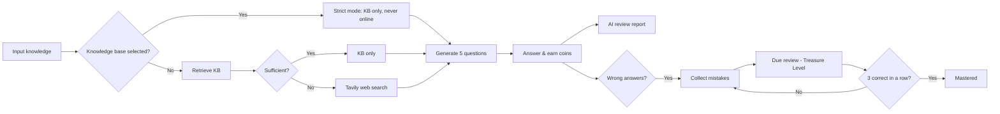
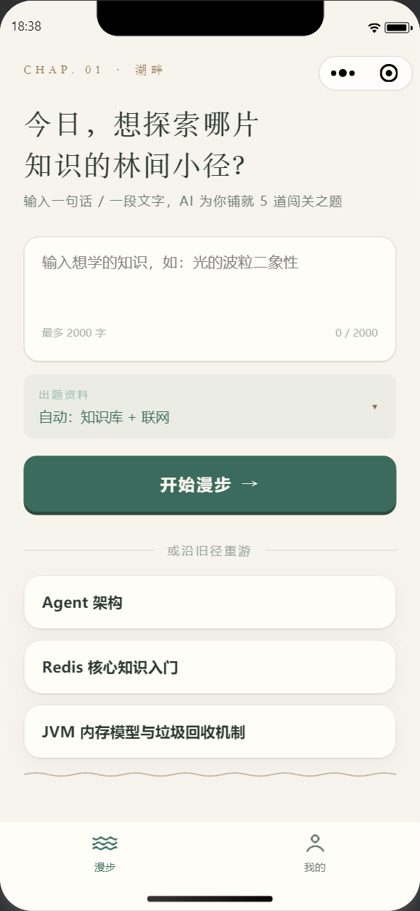
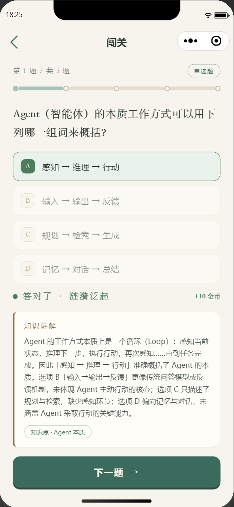
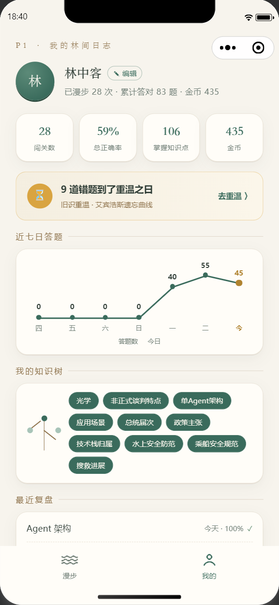
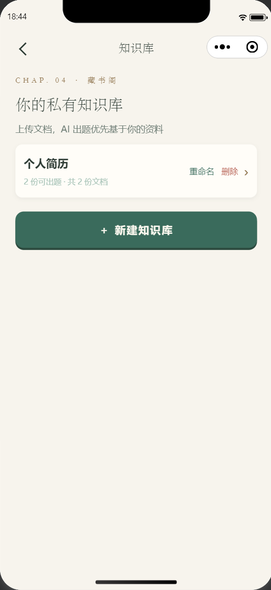
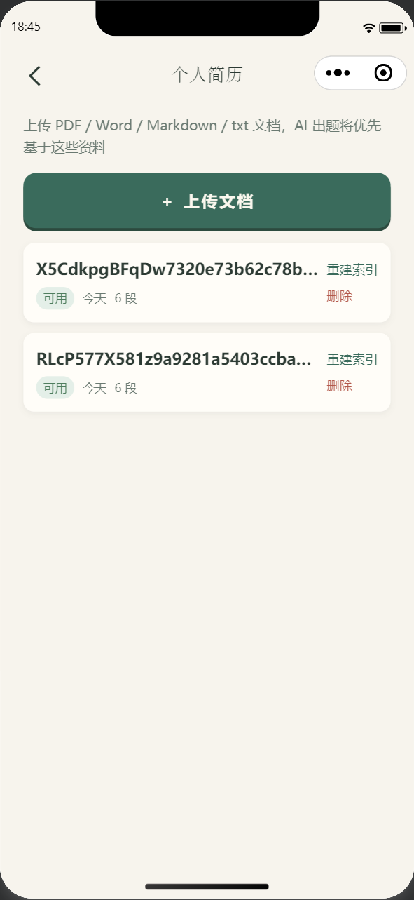
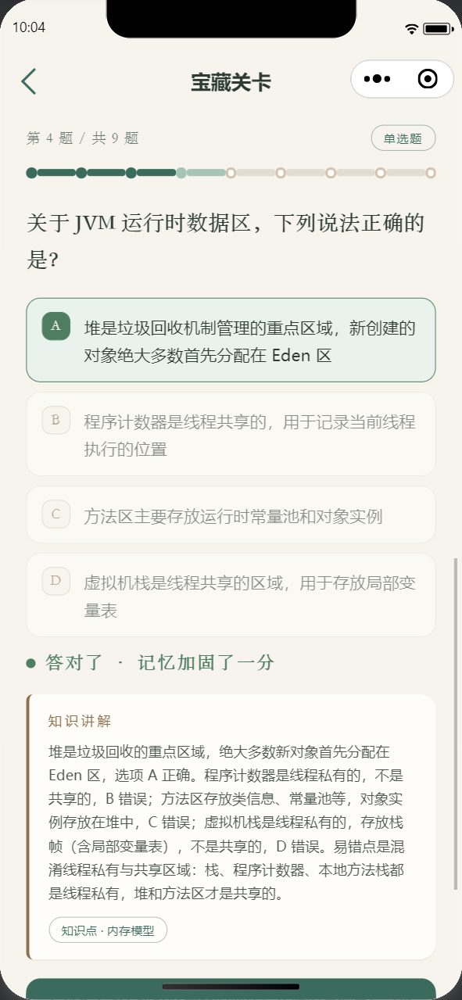
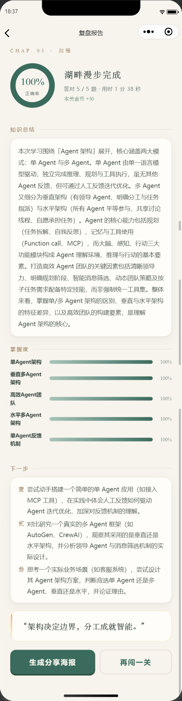
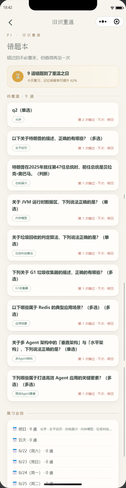

# AI Quest Learning Mini Program

> Feed your knowledge in — get AI-generated quizzes, coin rewards, review reports, and shareable posters.

[中文](README.md) | English

**License**: [MIT](LICENSE)

---

## Introduction

AI Quest Learning is a WeChat Mini Program (with an H5 build) for knowledge consolidation through gamified quiz challenges: users feed in any knowledge (a sentence, a paragraph, a document), the AI generates 5 questions (2 single-choice + 1 multiple-choice + 2 true/false), answering correctly earns +10 coins / incorrectly −5 coins, and each challenge is followed by an AI review report and a shareable poster.

Quiz generation is a **retrieval-augmented pipeline**: it first retrieves material from the user's private knowledge base (RAG); when that is insufficient it automatically fills gaps with web search (Tavily). Any stage failure silently degrades to plain input-based generation — the core challenge flow always stays available. Wrong answers are automatically collected and scheduled for review on the Ebbinghaus forgetting curve, with WeChat subscribe-message reminders.

**Tech summary**: FastAPI backend (Python + MySQL + Chroma vector store), Taro 4 + React 18 + TypeScript frontend (WeChat Mini Program & H5), LLM-generated quizzes via DeepSeek function calling with automatic degradation when optional services (search / embeddings) are unavailable.

## Key Features

| | Feature | Description |
|---|---|---|
| 📚 | **Retrieval-augmented quiz generation** | Private knowledge base (PDF/Word/Markdown/TXT upload, vector search) + Tavily web search fill-in; with a knowledge base selected, "strict mode" generates questions from KB material only, never online |
| ⛓️ | **Automatic degradation** | Search-plan failure / search timeout / KB not configured → silently degrade to plain input-based generation, without blocking or erroring the challenge |
| 🪙 | **Coin reward loop** | +10 for correct / −5 for wrong, balance floored at 0; server-side scoring (frontend not trusted); 24h anti-replay per identical content |
| 🧠 | **Ebbinghaus wrong-answer review** | Wrong answers auto-collected, SM-2 simplified schedule (1/2/4/7 days, 3 consecutive correct = "mastered"); one-click "Treasure Level" review, no coins involved |
| 🔔 | **Subscribe-message reminders** | One-time WeChat subscribe consent stored as quota, daily scheduled scan pushes reminders for due mistakes (logs only in dev) |
| 📊 | **AI review report** | Accuracy / knowledge summary / concept mastery / next-step suggestions / shareable poster |
| 🖥️ | **Dual-platform** | Same codebase for WeChat Mini Program + H5; H5 guest mode fully experiences the challenge loop |

## Business Flow



## Screenshots

> Captured in WeChat DevTools simulator (identical appearance on the H5 build).

<!-- markdownlint-disable MD033 -->

| Home | Quiz | Profile |
|---|---|---|
|  |  |  |

| Knowledge Base List | Knowledge Base Detail | Treasure Level |
|---|---|---|
|  |  |  |

| Review Report | Review Book |
|---|---|
|  |  |

<!-- markdownlint-enable MD033 -->

## Tech Stack

| Layer | Tech | Notes |
|---|---|---|
| Frontend | Taro 4 + React 18 + TypeScript | WeChat Mini Program + H5, webpack5 build |
| Backend | Python 3 + FastAPI + SQLAlchemy (async) | App-factory pattern, no Alembic (create_all on startup) |
| Database | MySQL 8 (Docker Compose) | Source of truth (users/challenges/coin transactions/review items/KB metadata/document text) |
| Vector store | Chroma (`kb_chunks` collection + metadata isolation) | Rebuildable derived index, MySQL is the source of truth |
| LLM | DeepSeek (function-calling structured output) | Quiz generation / review report / search planning / sufficiency judgment |
| Web search | Tavily (Search + Extract dual mode) | Fetches latest material before quiz generation, auto-degrades on failure |
| Embedding | Alibaba Cloud Bailian qwen (OpenAI-compatible endpoint) | Document vectorization and semantic retrieval |

## Project Structure

```
├── server/          # FastAPI backend (app/ source, tests/ unit tests, scripts/ smoke scripts, core/prompts/ prompt templates)
├── miniprogram/     # Taro frontend (src/pages/ pages, src/api/ request wrappers, dist/weapp|h5 build output)
├── prototype/       # HTML web prototype (design-stage interaction mockup)
├── docs/            # Requirements / design / implementation docs (single source of contract)
└── docker-compose.yml  # Middleware orchestration (MySQL, etc.)
```

## Quick Start

> The core challenge loop needs just 3 steps; Tavily / Embedding / WeChat subscribe are optional and auto-degrade when unconfigured.

### 0. Prerequisites

- Docker (MySQL), Python 3.11+, Node 18+
- WeChat DevTools (Mini Program only; `project.config.json` is ready)
- DeepSeek API Key (**required** — quiz generation and reports depend on it)

### 1. Start MySQL

```bash
docker compose up -d        # or bash start-docker.sh (Windows: start-docker.ps1)
```

### 2. Start the backend

```bash
cd server
cp .env.example .env        # edit and fill in DEEPSEEK_API_KEY (required); the rest is optional
python -m venv .venv        # first time only
.venv/Scripts/pip install -r requirements.txt   # Windows; use .venv/bin/pip on Linux/macOS
set -a && source .env && set +a
.venv/Scripts/python.exe -m uvicorn app.main:app --port 8000   # Windows
```

### 3. Start the frontend

```bash
cd miniprogram
npm install

# Option A: H5 (browser, guest mode)
npm run dev:h5

# Option B: WeChat Mini Program (import the project root into WeChat DevTools, appid already configured)
npm run dev:weapp
```

> Port conflict: if port 8000 is occupied/unavailable, start the backend on a free port and inject `TARO_APP_API_BASE=http://127.0.0.1:<new-port>` into the frontend (compile-time env var).

## Configuration

Backend configuration lives in `server/.env` (template in `server/.env.example`; sensitive values are placeholders and never committed):

| Key | Required | Description |
|---|---|---|
| `DEEPSEEK_API_KEY` | ✅ | LLM for quiz generation / report / judgment |
| `AUTH_MOCK` | Dev only | `true` skips WeChat code2session for local development |
| `TAVILY_API_KEY` | Optional | Unset → quiz generation skips the web-search stage (auto-degrade) |
| `EMBEDDING_API_KEY` / `EMBEDDING_BASE_URL` | Optional | Knowledge base feature; unset → upload API returns 400 with a hint, quiz generation skips the KB stage |
| `WECHAT_TMPL_REVIEW` | Optional | Review subscribe-message template ID; unset → frontend hides the subscribe button, push logs only |
| `REVIEW_PUSH_HOUR` | Optional | Daily review-reminder push hour (default 9) |
| `KB_CHROMA_DIR` | Optional | Chroma persistence directory; unset → in-memory mode (lost on restart, testing only) |

Frontend compile-time vars: `TARO_APP_API_BASE` (backend URL override), `TARO_APP_REVIEW_TMPL_ID` (subscribe template ID).

## Testing

```bash
cd server
.venv/Scripts/python.exe -m pytest -q        # 285 unit tests (in-memory SQLite + FakeLLM, no real services or network)
```

Real-MySQL smoke scripts (backend must be running): `scripts/smoke.py` (core loop), `smoke_user.py` (user system), `smoke_review.py` (wrong-answer review), `smoke_search.py` (web search), `smoke_knowledge_base.py` (knowledge base RAG).

Frontend type check: `cd miniprogram && npm run typecheck`.

## Documentation

| Doc | Content |
|---|---|
| [docs/需求分析文档.md](docs/需求分析文档.md) | Requirements analysis (P1/P2 feature tiers) |
| [docs/方案设计文档.md](docs/方案设计文档.md) | Overall technical design (incl. retrieval-augmented/RAG chapters) |
| [docs/需求分析文档-用户系统.md](docs/需求分析文档-用户系统.md) | User-system-specific requirements |
| [docs/方案设计文档-用户系统.md](docs/方案设计文档-用户系统.md) | User-system-specific design (single source of contract) |

## Community

QQ Group: **967925576** — questions, feedback and feature ideas are welcome.

---

**License**: [MIT](LICENSE)
