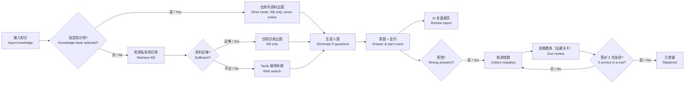

# AI 闯关学习小程序（AI Quest Learning）

> 输入知识 → AI 出题 → 闯关答题 → 复盘报告 → 分享海报，一整套「轻学习」闭环。
> Feed your knowledge in — get AI-generated quizzes, coin rewards, review reports, and shareable posters.

**English summary**: A WeChat Mini Program (with H5 build) for self-directed learning through AI-generated quizzes. Key differentiators: retrieval-augmented quiz generation (private knowledge base RAG + web search), a coin reward system with anti-cheat, and Ebbinghaus forgetting-curve wrong-answer review.

---

## 介绍 / Introduction

AI 闯关学习小程序是一个以「闯关」为形式的知识巩固工具：用户输入任意知识（一句话、一段文字、一篇文档），AI 生成 5 道题（2 单选 + 1 多选 + 2 判断），答对 +10 金币 / 答错 −5 金币，闯关后生成 AI 复盘报告并支持生成分享海报。

出题环节为**检索增强流水线**：优先从用户私有知识库（RAG）检索资料，不足时自动联网（Tavily）补缺，任一环节失败都静默降级为纯输入出题——保证核心闯关流程永远可用。答错的题目自动收录为错题，按艾宾浩斯遗忘曲线调度重练，并通过微信订阅消息提醒。

**Tech summary**: FastAPI backend (Python + MySQL + Chroma vector store), Taro 4 + React 18 + TypeScript frontend (WeChat Mini Program & H5), LLM-generated quizzes via DeepSeek function calling with automatic degradation when optional services (search / embeddings) are unavailable.

## 核心亮点 / Key Features

| | 功能 | 说明 |
|---|---|---|
| 📚 | **检索增强出题** | 私有知识库（PDF/Word/Markdown/TXT 上传，向量检索）+ Tavily 联网补缺；指定知识库时为「严格模式」，题目仅来自库内资料、永不联网 |
| ⛓️ | **故障自动降级** | 检索计划失败 / 搜索超时 / 知识库未配置 → 自动降级为纯输入出题，不阻塞闯关、不向用户报错 |
| 🪙 | **金币激励闭环** | 答对 +10 / 答错 −5，余额封底不为负；服务端判分不信任前端；同内容 24h 防刷 |
| 🧠 | **艾宾浩斯错题重练** | 答错自动收录，SM-2 简化调度（1/2/4/7 天递增，连续 3 次答对「已掌握」）；「宝藏关卡」一键重练，不计金币 |
| 🔔 | **订阅消息提醒** | 微信一次性订阅授权落库，每日定时扫描到期错题推送提醒（开发期降级为日志） |
| 📊 | **AI 复盘报告** | 正确率 / 知识总结 / 知识点掌握度 / 下一步学习建议 / 分享海报 |
| 🖥️ | **双端运行** | 微信小程序 + H5 同一套代码；H5 游客模式可完整体验闯关闭环 |

## 业务流程图 / Business Flow



## 界面截图 / Screenshots

> 微信开发者工具模拟器截图（H5 端运行形态一致）。

| 首页 Home | 闯关答题 Quiz | 复盘报告 Report |
|---|---|---|
|  |  |  |

| 我的页 Profile | 错题本 Review | 知识库列表 Knowledge Base |
|---|---|---|
|  |  |  |

| 知识库详情 KB Detail |
|---|
|  |

## 技术栈 / Tech Stack

| 层 | 技术 | 说明 |
|---|---|---|
| 前端 | Taro 4 + React 18 + TypeScript | 微信小程序 + H5 双端，webpack5 构建 |
| 后端 | Python 3 + FastAPI + SQLAlchemy (async) | 应用工厂模式，无 Alembic（启动时 create_all） |
| 数据库 | MySQL 8（Docker Compose 管理） | 权威数据源（用户/闯关/金币流水/错题/知识库元数据/文档全文） |
| 向量检索 | Chroma（`kb_chunks` collection + metadata 隔离） | 可重建的派生索引，MySQL 为权威源 |
| LLM | DeepSeek（function calling 结构化输出） | 出题 / 复盘报告 / 检索计划 / 资料足够性判定 |
| 联网搜索 | Tavily（Search + Extract 双模式） | 出题前检索最新资料，失败自动降级 |
| Embedding | 阿里云百炼 qwen（OpenAI 兼容端点） | 文档向量化与语义检索 |

## 目录结构 / Project Structure

```
├── server/          # FastAPI 后端（app/ 源码、tests/ 单测、scripts/ 冒烟脚本、core/prompts/ Prompt 模板）
├── miniprogram/     # Taro 前端（src/pages/ 页面、src/api/ 请求封装、dist/weapp|h5 构建产物）
├── prototype/       # HTML 网页原型（设计阶段的交互稿）
├── docs/            # 需求分析 / 方案设计 / 实施计划文档（契约单一来源）
└── docker-compose.yml  # MySQL 等中间件编排
```

## 快速启动 / Quick Start

> 核心闯关闭环只需 3 步；Tavily / Embedding / 微信订阅均为可选，未配置时自动降级。

### 0. 前置依赖 / Prerequisites

- Docker（MySQL）、Python 3.11+、Node 18+
- 微信开发者工具（仅小程序端需要，`project.config.json` 已配好）
- DeepSeek API Key（**必需**，出题与报告依赖）

### 1. 启动 MySQL

```bash
docker compose up -d        # 或 bash start-docker.sh（Windows: start-docker.ps1）
```

### 2. 启动后端 / Start the backend

```bash
cd server
cp .env.example .env        # 编辑填入 DEEPSEEK_API_KEY（必填）；其余可选
python -m venv .venv        # 首次
.venv/Scripts/pip install -r requirements.txt   # Windows；Linux/macOS 用 .venv/bin/pip
set -a && source .env && set +a
.venv/Scripts/python.exe -m uvicorn app.main:app --port 8000   # Windows
```

### 3. 启动前端 / Start the frontend

```bash
cd miniprogram
npm install

# 方式 A：H5（浏览器直接体验，游客模式）
npm run dev:h5

# 方式 B：微信小程序（微信开发者工具导入项目根目录，appid 已配置）
npm run dev:weapp
```

> 端口冲突：本机 8000 被占用/不可用时，换空闲端口启动后端，并给前端注入 `TARO_APP_API_BASE=http://127.0.0.1:<新端口>`（编译期环境变量）。

## 配置说明 / Configuration

后端配置统一在 `server/.env`（模板见 `server/.env.example`，敏感值一律占位符，不入仓库）：

| 配置项 | 必填 | 说明 |
|---|---|---|
| `DEEPSEEK_API_KEY` | ✅ | 出题/报告/判定的 LLM |
| `AUTH_MOCK` | 开发期 | `true` 跳过微信 code2session，本地免真实登录 |
| `TAVILY_API_KEY` | 可选 | 未配置 → 出题跳过联网段（自动降级） |
| `EMBEDDING_API_KEY` / `EMBEDDING_BASE_URL` | 可选 | 知识库功能；未配置 → 上传接口 400 提示、出题跳过知识库段 |
| `WECHAT_TMPL_REVIEW` | 可选 | 错题订阅消息模板 ID；未配置 → 前端隐藏订阅按钮、推送仅记日志 |
| `REVIEW_PUSH_HOUR` | 可选 | 每日错题提醒推送时刻（默认 9 点） |
| `KB_CHROMA_DIR` | 可选 | Chroma 持久化目录；未配置时内存模式（重启即丢，仅测试用） |

前端编译期变量：`TARO_APP_API_BASE`（后端地址覆盖）、`TARO_APP_REVIEW_TMPL_ID`（订阅模板 ID）。

## 测试 / Testing

```bash
cd server
.venv/Scripts/python.exe -m pytest -q        # 285 个单测（SQLite 内存库 + FakeLLM，不依赖真实服务与网络）
```

真实 MySQL 冒烟脚本（需后端已启动）：`scripts/smoke.py`（基础闭环）、`smoke_user.py`（用户系统）、`smoke_review.py`（错题重练）、`smoke_search.py`（联网搜索）、`smoke_knowledge_base.py`（知识库 RAG）。

前端类型检查：`cd miniprogram && npm run typecheck`。

## 文档索引 / Documentation

| 文档 | 内容 |
|---|---|
| [docs/需求分析文档.md](docs/需求分析文档.md) | 需求分析（功能分级 P1/P2） |
| [docs/方案设计文档.md](docs/方案设计文档.md) | 总体技术方案（含检索增强/RAG 设计章节） |
| [docs/需求分析文档-用户系统.md](docs/需求分析文档-用户系统.md) | 用户系统专项需求 |
| [docs/方案设计文档-用户系统.md](docs/方案设计文档-用户系统.md) | 用户系统专项方案（契约单一来源） |

---

**License**: Not specified. Please contact the author for usage rights.
