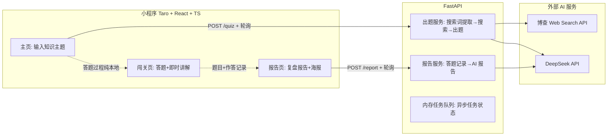
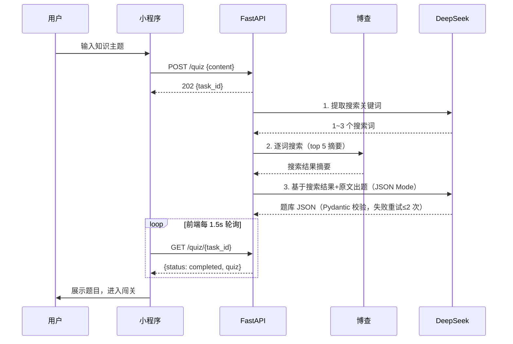
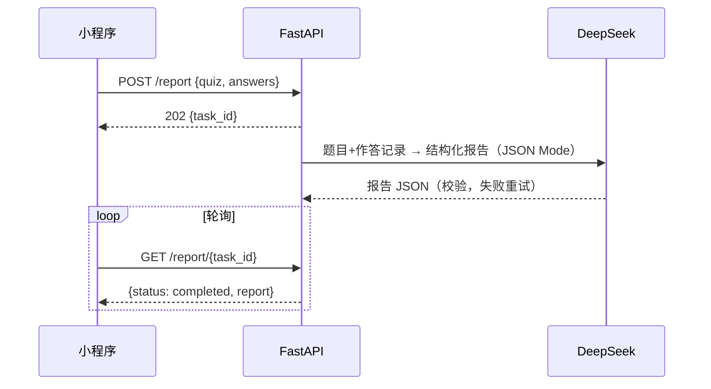

<!-- vscode-markdown-toc -->
* 1. [1. 项目概述](#)
  * 1.1. [1.1 产品定位](#-1)
  * 1.2. [1.2 核心业务流程（MVP 唯一目标）](#MVP)
  * 1.3. [1.3 MVP 范围界定](#MVP-1)
* 1. [2. 技术选型](#-1)
  * 2.1. [2.1 选型总览](#-1)
  * 2.2. [2.2 小程序端选型（重点）：原生 vs Taro vs uni-app](#vsTarovsuni-app)
    * 2.2.1. [2.2.1 三方现状（来自官方文档/官方发布记录）](#-1)
    * 2.2.2. [微信原生（TS + Skyline + glass-easel）](#TSSkylineglass-easel)
    * 2.2.3. [Taro（京东开源）](#Taro)
    * 2.2.4. [uni-app（DCloud）](#uni-appDCloud)
    * 2.2.5. [2.2.2 维度对比](#-1)
    * 2.2.6. [2.2.3 选型结论：Taro 4.2.1（React + TS）](#Taro4.2.1ReactTS)
  * 2.3. [2.3 后端选型：FastAPI](#FastAPI)
  * 2.4. [2.4 AI 大模型选型：DeepSeek](#AIDeepSeek)
  * 2.5. [2.5 联网搜索选型：博查 Bocha](#Bocha)
* 1. [3. 系统架构设计](#-1)
  * 3.1. [3.1 总体架构](#-1)
  * 3.2. [3.2 核心时序：出题（异步任务 + 轮询）](#-1)
  * 3.3. [3.3 核心时序：答题与报告](#-1)
  * 3.4. [3.4 后端模块划分](#-1)
  * 3.5. [3.5 小程序端设计](#-1)
* 1. [4. 接口与数据契约](#-1)
  * 4.1. [4.1 API 设计](#API)
  * 4.2. [4.2 题库数据契约（后端出题 → 前端答题的共同语言）](#-1)
  * 4.3. [4.3 报告数据契约](#-1)
  * 4.4. [4.4 异常处理原则](#-1)
* 1. [5. AI 工程设计](#AI)
  * 5.1. [5.1 出题流水线（三段式）](#-1)
  * 5.2. [5.2 Prompt 模板（初始版，存放于 `server/app/core/prompts/`）](#Promptserverappcoreprompts)
    * 5.2.1. [步骤 1：搜索词提取](#1)
    * 5.2.2. [步骤 3：出题（核心）](#3)
    * 5.2.3. [报告生成](#-1)
  * 5.3. [5.3 JSON 输出可靠性保障](#JSON)
  * 5.4. [5.4 内容合规（MVP 轻量方案）](#MVP-1)
* 1. [6. 开发流程与实施步骤](#-1)
  * 6.1. [步骤 0：环境与账号准备](#0)
  * 6.2. [步骤 1：后端出题服务（核心中的核心）](#1-1)
  * 6.3. [步骤 2：小程序主页 + 闯关页（前端核心闭环的前半段）](#2)
  * 6.4. [步骤 3：报告服务 + 报告页（跑通完整闭环 ✅）](#3-1)
  * 6.5. [步骤 4：分享海报](#4)
  * 6.6. [后续迭代路线（对应需求文档 P1~P3）](#P1P3)
* 1. [7. 工程结构与开发规范](#-1)
  * 7.1. [7.1 目录结构（monorepo）](#monorepo)
  * 7.2. [7.2 开发规范要点](#-1)
* 1. [8. 测试策略](#-1)
* 1. [9. 成本估算](#-1)
* 1. [10. 风险与应对](#-1)
* 1. [11. 附录：参考资料](#-1)

<!-- vscode-markdown-toc-config
	numbering=false
	autoSave=true
	/vscode-markdown-toc-config -->
<!-- /vscode-markdown-toc --># 《AI 闯关学习小程序》方案设计文档

| 项目 | 内容 |
| --- | --- |
| 文档版本 | v1.0 |
| 编写日期 | 2026-08-15 |
| 状态 | 待评审 |
| 配套文档 | `需求分析文档.md` |

---

## 1. <a name=''></a>1. 项目概述

### 1.1. <a name='-1'></a>1.1 产品定位

深度集成微信生态的 AI 学习小程序，将用户输入的非结构化知识（一句话、一段文本，后续扩展到文档/视频/网页）转化为交互式问答闯关游戏，主打"万物皆可闯关"。

### 1.2. <a name='MVP'></a>1.2 核心业务流程（MVP 唯一目标）

```text
用户输入内容 → AI 联网补充知识 → AI 生成题库 → 用户答题闯关（即时判分+讲解）→ AI 生成复盘报告
```

MVP 的唯一验收标准：**这条闭环在真机上完整跑通**。

### 1.3. <a name='MVP-1'></a>1.3 MVP 范围界定

| 类别 | 内容 |
| --- | --- |
| ✅ 做 | 单文本输入、AI 联网出题（5 题：单选/多选/判断）、答题即时判分与讲解、AI 复盘报告、分享海报（Canvas） |
| ❌ 不做 | 用户登录注册、数据库持久化、金币/经验值系统、多格式输入（PDF/Word/URL/视频）、RAG 私有知识库、排行榜与 PK、付费模型、服务器部署上线 |

不做登录注册与数据库的原因：MVP 阶段验证的是"AI 出题质量 + 游戏化学习体验"这一核心假设，答题与报告均为一次性即时交互，无需持久化；引入账号体系会显著拉长开发周期且不改变核心假设的验证结果。

> 决策记录：金币/经验值系统曾在需求文档 MVP 清单中，经确认**整体延后**（含纯前端本地假数据方案），答题页只做对错判定与讲解。

---
~
## 2. <a name='-1'></a>2. 技术选型

### 2.1. <a name='-1'></a>2.1 选型总览

| 层 | 选型 | 版本（2026-08） |
| --- | --- | --- |
| 小程序端 | **Taro + React + TypeScript** | Taro 4.2.1 |
| 后端 | **Python + FastAPI** | Python 3.11+，FastAPI 最新稳定版 | todo AI大模型的对接使用Python的langchain框架
| 大模型 | **DeepSeek**（官方 API） | deepseek-v4-flash | todo OpenAI兼容API
| 联网搜索 | **博查 Bocha Web Search API** | v1 | todo 非核心mvp，先让AI直接出题
| 数据存储 | 无（MVP 零数据库） | — | todo 大概率mysql

### 2.2. <a name='vsTarovsuni-app'></a>2.2 小程序端选型（重点）：原生 vs Taro vs uni-app

选型时间点：2026-08。以下对比基于三方官方文档与发布记录核实。

#### 2.2.1. <a name='-1'></a>2.2.1 三方现状（来自官方文档/官方发布记录）

#### 2.2.2. <a name='TSSkylineglass-easel'></a>微信原生（TS + Skyline + glass-easel）

* 基础库 v3.17.1（2026-07-01），每月 1~2 次高频迭代；
* Skyline 渲染引擎每个版本均有修复/增强（v3.17.1 修复 skyline placeholder、v3.15.2 新增 selection 支持、v3.14.2 支持 ScrollViewContext velocity…），接入量同比增长 17 倍，鸿蒙微信已灰度支持；启动耗时降 20%、跳页耗时降 50%；
* glass-easel 组件框架为官方推进方向（WebView 模式也在迁移），有专门适配指引；
* TypeScript 官方模板、miniprogram-ci 命令行发布均已成熟。

#### 2.2.3. <a name='Taro'></a>Taro（京东开源）

* 最新 v4.2.1（2025-07-17），**此后一年未发新版**；3.x/4.x 双线维护（3.x 仅修复）；
* 4.x 更新日志中无任何 Skyline 支持内容，近期重心为鸿蒙适配与 vite 支持；
* 社区反馈（2025-2026）普遍认为 4.x 升级路径混乱、生态未跟上，部分项目保持在 3.x；
* UI 生态单薄，成熟可用仅 NutUI（京东官方，React/Vue 双版本）。

#### 2.2.4. <a name='uni-appDCloud'></a>uni-app（DCloud）

* 版本线 4.87 → 5.x（2026-07 发布 5.15），重心明显转向 App 端（"蒸汽模式"新渲染系统、uni-app x 编译为原生），微信小程序端以跟随修复为主；
* 生态最大（插件市场、踩坑案例最多）、Vue 语法、条件编译灵活；
* 短板：微信新能力跟进滞后；组件库命名混乱（uView 四个分支）；HBuilderX 强绑定（可用 CLI 绕开）。

#### 2.2.5. <a name='-1'></a>2.2.2 维度对比

| 维度 | 微信原生 | Taro 4.x | uni-app |
| --- | --- | --- | --- |
| 最新版本（2026-08） | 基础库 v3.17.1，月更 | v4.2.1，停更 1 年+ | 5.x，重心在 App |
| 微信新 API 跟进 | 官方即时 | 滞后、无 Skyline | 滞后 |
| 性能 | 最佳（Skyline 独立渲染线程） | 编译层损耗（业务场景够用） | 编译层损耗 |
| 跨端能力 | 仅微信 | 微信/支付宝/抖音/百度等 + H5 | 最广（含 App/H5/全部小程序） |
| 语言/语法 | WXML/WXSS/TS | React/Vue/TS | Vue |
| UI 组件生态 | 官方组件 + 社区（TDesign 小程序等） | NutUI 单薄 | 最大（质量参差） |
| 开发工具 | 微信开发者工具 | VSCode 任意 + 开发者工具预览 | HBuilderX 或 CLI+VSCode |

#### 2.2.6. <a name='Taro4.2.1ReactTS'></a>2.2.3 选型结论：Taro 4.2.1（React + TS）

**选择理由**（已与需求方确认）：

1. 需求方有 React 技术基础，且保留未来发布 H5 / 其他平台小程序的可能性——跨端是 Taro 的核心价值；
2. 本项目 MVP 页面少（3 页）、以文本交互为主，无长列表/复杂动画等编译层损耗敏感场景，Taro 的性能代价在本项目中不可感知；
3. 本项目对微信能力的使用（分享海报、保存相册、小程序码）均为 Taro 成熟封装范围，风险可控。

**风险对策**（详见第 11 章）：

* **版本策略**：锁定 Taro 4.2.1，不追新版本；依赖全部锁死版本号（package.json 精确版本 + lock 文件）；
* **逃生通道**：Taro 支持与微信原生代码混写（`taro convert` 反向迁移成本也较低），若遇到框架无法覆盖的微信新 API，可局部降级为原生写法，不必整体迁移；
* **不引入 UI 组件库**：MVP 界面元素简单（输入框、题目卡片、选项按钮、报告卡片），使用 Taro 内置组件 + SCSS 手写，消除对 NutUI 的单点依赖。

### 2.3. <a name='FastAPI'></a>2.3 后端选型：FastAPI

| 对比项 | FastAPI | Spring Boot | Node.js |
| --- | --- | --- | --- |
| AI/RAG 生态 | ★★★ 最强（openai SDK、向量库、文档解析库一应俱全） | ★☆ 需更多胶水代码 | ★★ 强 |
| MVP 开发速度 | 快（异步任务、Pydantic 校验开箱即用） | 慢 | 快 |
| 与需求方技术栈匹配 | 与 AI 生态契合 | 需求方主力栈 | 与前端同语言 |

选择理由：本项目是 AI 应用，Python 生态在 LLM SDK、JSON 校验（Pydantic）、后续 RAG（向量库/文档解析）上优势最大；已与需求方确认放弃 Java 路线。

### 2.4. <a name='AIDeepSeek'></a>2.4 AI 大模型选型：DeepSeek

**模型**：`deepseek-v4-flash`（官方 API 性价比档位；若实测出题质量不足，升级 `deepseek-v4-pro`，两者 API 兼容，切换仅改一行配置）。

**选型理由**：

* 成本极低、中文能力强、JSON 结构化输出稳定，适合大批量生成题目；
* OpenAI 兼容接口，可无缝使用 `openai` SDK；
* 联网搜索通过独立搜索 API 实现，模型与搜索源解耦，均可独立替换。

**价格**（每百万 tokens，2026-08-16 起执行峰谷计价，UTC 01:00–04:00、06:00–10:00 为峰时，其余谷时半价）：

| 模型 | 时段 | 输入（未命中缓存） | 输出 |
| --- | --- | --- | --- |
| deepseek-v4-flash | 谷时 | $0.22（≈¥1.6） | $0.66（≈¥4.8） |
| deepseek-v4-flash | 峰时 | $0.44（≈¥3.2） | $1.32（≈¥9.5） |
| deepseek-v4-pro | 谷时 | $0.66（≈¥4.8） | $1.98（≈¥14） |

> 注意：DeepSeek 于 2026-08-06 公告整体上调定价。价格以官方定价页为准，本表仅用于成本量级估算。

### 2.5. <a name='Bocha'></a>2.5 联网搜索选型：博查 Bocha

**选型理由**：博查为国内服务（低延迟、数据不出海、内容合规），是 DeepSeek 官方联网搜索供应商；中文搜索质量好；搜索结果自带 AI 摘要（LLM 友好，可直接喂给模型）；按次计费价格最低。

| 对比项 | 博查 Bocha | Tavily | Serper |
| --- | --- | --- | --- |
| 国内直连 | ✅ 稳定 | ✅ 偶有波动 | ✅ |
| 中文搜索质量 | 最好 | 一般 | 依赖 Google（国内内容弱） |
| 价格 | ¥0.036/次（试用套餐 ¥3.6/千次） | $0.008/次起（免费 1000 次/月） | $2/千次 |
| 内容合规 | 数据不出海 | 跨境 | 跨境 |
| 结果形态 | 标题+URL+摘要+AI 摘要 | LLM 清洗后内容 | 仅标题+链接+片段 |

**接口**：`POST https://api.bochaai.com/v1/web-search`，参数 `query`/`count`/`summary=true`，返回 `data.webPages.value[]`（含 `name`/`url`/`summary`/`snippet`/`siteName`）。

**降级策略**：搜索 API 失败或超时时，跳过搜索直接基于用户输入出题（保底可用，不阻塞核心流程）。

---

## 3. <a name='-1'></a>3. 系统架构设计

### 3.1. <a name='-1'></a>3.1 总体架构



### 3.2. <a name='-1'></a>3.2 核心时序：出题（异步任务 + 轮询）



**为什么用轮询而不是 SSE/WebSocket**：小程序 `wx.request` 对 SSE 流式支持有限（需 `enableChunked`，Taro 封装不稳定），WebSocket 需额外连接管理；出题耗时 10~30 秒，1.5s 轮询的延迟感知可接受，实现最简最稳。P1 阶段若做逐题流式出题，再评估升级。

### 3.3. <a name='-1'></a>3.3 核心时序：答题与报告

**答题过程全部在小程序本地完成**：题目已包含答案与讲解，用户点选后立即判分并展示讲解卡片（答对答错均展示），无后端参与——这是保证答题体验零延迟的关键设计。

**报告生成**（复用异步任务+轮询模式）：



### 3.4. <a name='-1'></a>3.4 后端模块划分

| 模块 | 职责 | 依赖 |
| --- | --- | --- |
| `api/routes` | 路由层：参数校验、任务创建与查询 | services |
| `services/quiz` | 出题流水线编排：搜索词提取→搜索→出题→校验重试 | llm, search |
| `services/report` | 报告生成与校验重试 | llm |
| `services/llm` | DeepSeek 客户端封装（JSON Mode、超时、重试、错误归一化） | openai SDK |
| `services/search` | 博查客户端封装（超时、失败降级） | httpx |
| `core/tasks` | 内存任务队列：`{task_id: {status, payload, error, created_at}}`，超时清理 | — |
| `core/prompts` | 全部 Prompt 模板集中管理（独立文件，便于迭代） | — |
| `core/sensitive` | 敏感词过滤（黑名单词表 + 简单匹配） | — |
| `models/schemas` | Pydantic 模型：请求/响应/题库/报告契约 | — |

模块间只通过接口交互（services 只依赖 llm/search 的公开方法），LLM 与搜索源可独立替换——应对 DeepSeek 涨价/容量波动的关键设计。

### 3.5. <a name='-1'></a>3.5 小程序端设计     todo 前端页面与UI设计目前不用太关注，后续会单独设计开发网页原型，然后再做小程序

**页面（3 页）与数据流**：

| 页面 | 职责 | 关键状态 |
| --- | --- | --- |
| `pages/index` 主页 | 单输入框 + 生成按钮；生成中展示 loading 动画并轮询 | 输入文本、task_id |
| `pages/quiz` 闯关页 | 题目展示、选项点选、即时判分与讲解卡片、进度条 | quiz 数据（Storage 传递）、当前题号、作答记录 |
| `pages/report` 报告页 | 正确率、知识总结、知识点掌握度、学习建议、金句；生成海报按钮；微信转发分享（`useShareAppMessage` 转发卡片） | report 数据、作答记录 |

**技术要点**：

* **状态管理**：React Hooks + Taro Storage。quiz 数据与作答记录通过 `Taro.setStorageSync` 在页面间传递，不引入 Redux/Zustand（YAGNI）；
* **网络层**：封装 `request` 工具（基于 `Taro.request`，统一 baseUrl/超时/错误提示）；
* **轮询组件**：自定义 `usePollingTask` Hook（1.5s 间隔、超时 90s 提示失败、卸载时停止）；
* **样式**：SCSS + 750 设计稿，不引入 UI 库；
* **海报**：`canvas` 组件 + `Taro.canvasToTempFilePath` 导出 → `Taro.saveImageToPhotosAlbum` 保存相册。小程序码依赖后端微信接口与已注册小程序，本地调试阶段用占位图，上线阶段接入。

---

## 4. <a name='-1'></a>4. 接口与数据契约

### 4.1. <a name='API'></a>4.1 API 设计

遵循 REST 风格：URL 名词单数，语义化状态码。

| 接口 | 方法 | 请求 | 响应 |
| --- | --- | --- | --- |
| `/quiz` | POST | `{content: string}` | `202 {task_id}`；`422` 内容为空/超长（≤2000 字） |
| `/quiz/{task_id}` | GET | — | `{status, quiz?, error?}`；`404` 任务不存在 |
| `/report` | POST | `{quiz, answers}` | `202 {task_id}`；`422` 数据不合契约 |
| `/report/{task_id}` | GET | — | `{status, report?, error?}`；`404` 任务不存在 |

`status` 枚举：`pending` / `running` / `completed` / `failed`（`failed` 时 `error` 含用户可读的失败原因与错误码）。

错误码约定：`LLM_TIMEOUT` / `LLM_PARSE_FAILED` / `SEARCH_FAILED_DEGRADED` / `TASK_TIMEOUT`。前端按错误码给出对应文案与"重试"按钮。

### 4.2. <a name='-1'></a>4.2 题库数据契约（后端出题 → 前端答题的共同语言）

```jsonc
{
  "topic": "字符串",                    // 学习主题名（用于报告页标题）
  "source_summary": "字符串",           // AI 基于搜索补充的知识摘要（用于报告生成，不直接展示）
  "questions": [
    {
      "id": 1,                          // 从 1 递增
      "type": "single",                 // "single" | "multiple" | "judge"
      "question": "题干（judge 时为判断句）",
      "options": ["选项1", "选项2", "选项3", "选项4"],
      // judge 固定为 ["正确", "错误"]；single 4 项；multiple 4 项
      "answer": [0],                    // 正确选项索引数组（judge 为 [0] 或 [1]；multiple 至少 2 个）
      "explanation": "深度讲解：为什么对、易错点在哪（答对答错都展示）",
      "knowledge_point": "考察的知识点标签（≤10 字，用于报告中的掌握度分析）"
    }
  ]
}
```

**约束**：5 题 = 2 单选 + 1 多选 + 2 判断（Prompt 中要求，Pydantic 校验类型分布，不满足则整体重试）。

### 4.3. <a name='-1'></a>4.3 报告数据契约

```jsonc
{
  "correct_rate": 80,                   // 正确率 0-100
  "correct_count": 4,
  "total_questions": 5,
  "summary": "本次学习的知识总结（200~300 字，基于 source_summary 与题目讲解）",
  "mastery": [                          // 逐知识点掌握度
    {"knowledge_point": "字符串", "level": 90, "comment": "掌握良好，注意 xx"}
  ],
  "suggestions": ["学习建议1", "学习建议2"],   // 2~3 条可执行建议
  "quote": "学习金句（≤30 字，用于海报）"
}
```

### 4.4. <a name='-1'></a>4.4 异常处理原则

* **LLM 调用失败**（超时/限流/JSON 解析失败）：自动重试 ≤2 次（指数退避 2s/4s）；仍失败则任务置 `failed`，前端提示"生成失败，请重试"；
* **搜索失败**：不阻塞——降级为仅基于用户输入出题，quiz 中 `source_summary` 由模型基于输入生成；
* **任务超时**：120s 未完成置 `failed`（TASK_TIMEOUT）；内存任务 30 分钟自动清理（MVP 服务器重启丢任务可接受）。

---

## 5. <a name='AI'></a>5. AI 工程设计

### 5.1. <a name='-1'></a>5.1 出题流水线（三段式）

```
用户输入 content
  → [LLM 步骤1] 生成 1~3 个搜索关键词（短句搜索效果优于整段输入）
  → [博查 步骤2] 逐关键词搜索，各取 top5 的 summary 拼接（总长度截断至 ~4000 字）
  → [LLM 步骤3] 基于「用户输入 + 搜索结果」生成题库 JSON（JSON Mode + Pydantic 校验 + 重试）
```

要点：

* 步骤 1/2 都失败 → 跳过，步骤 3 仅基于用户输入出题（降级路径）；
* 所有温度参数：出题 `temperature=0.7`（保证题目多样性）、报告 `0.5`、搜索词提取 `0.3`；
* 系统提示词固定不变（可被 DeepSeek 上下文缓存命中，降低输入成本）。

### 5.2. <a name='Promptserverappcoreprompts'></a>5.2 Prompt 模板（初始版，存放于 `server/app/core/prompts/`）

#### 5.2.1. <a name='1'></a>步骤 1：搜索词提取

```text
你是一个学习主题搜索词生成器。根据用户想要学习的知识内容，
生成 1~3 个用于搜索引擎查询的关键词（每个不超过 15 字），
优先选择能检索到权威、系统化学习资料的表述。
仅输出 JSON：{"queries": ["...", "..."]}
```

#### 5.2.2. <a name='3'></a>步骤 3：出题（核心）

```text
你是一位经验丰富的学习教练。根据「用户想学的知识」和「参考资料」，
设计一套交互式闯关题目，帮助用户掌握该知识的核心要点。

【用户想学的知识】
{content}

【参考资料】
{search_results}

【出题要求】
1. 共 5 道题：2 道单选题、1 道多选题、2 道判断题；
2. 题目由浅入深，覆盖该知识最核心的 3~5 个知识点；
3. 每道题的 explanation 必须深入讲解：说明正确选项为什么正确、
   易混淆选项错在哪里、关联的易错点；语言通俗易懂，150 字左右；
4. knowledge_point 为该题考察的知识点标签（≤10 字），
   不同题目可以有相同知识点；
5. 判断题的 options 固定为 ["正确", "错误"]；
6. 内容不得包含任何政治敏感、违法或违反公序良俗的表述。

仅输出 JSON（不要输出任何其他文字）：
{
  "topic": "主题名",
  "source_summary": "基于参考资料整理的知识摘要，300 字左右",
  "questions": [
    {
      "id": 1, "type": "single", "question": "...",
      "options": ["...", "...", "...", "..."],
      "answer": [0],
      "explanation": "...",
      "knowledge_point": "..."
    }
  ]
}
```

#### 5.2.3. <a name='-1'></a>报告生成

```text
你是一位学习教练，请根据学生的「闯关记录」生成学习复盘报告。

【闯关记录】
题目与讲解：{quiz}
学生作答：{answers}   // [{question_id, selected}]

【要求】
1. summary：结合题目讲解与 source_summary，总结本次学习的核心知识（200~300 字）；
2. mastery：按 knowledge_point 聚合，评估学生每个知识点的掌握程度（0~100），
   答错的题其知识点得分应显著降低，comment 给出针对该学生的具体点评；
3. suggestions：2~3 条下一步可执行的学习建议；
4. quote：一句与本次学习主题相关的学习金句（≤30 字，有感染力）。

仅输出 JSON：{"correct_rate": 80, "correct_count": 4, "total_questions": 5,
"summary": "...", "mastery": [...], "suggestions": [...], "quote": "..."}
```

### 5.3. <a name='JSON'></a>5.3 JSON 输出可靠性保障

1. 请求参数 `response_format={"type": "json_object"}`（DeepSeek JSON Mode）；
2. 响应经 Pydantic 模型严格校验（类型、题目数量、题型分布、选项数量、answer 索引越界检查）；
3. 校验失败 → 原请求重试 ≤2 次；仍失败 → 任务 `failed`（LLM_PARSE_FAILED），绝不把坏数据发给前端。

### 5.4. <a name='MVP-1'></a>5.4 内容合规（MVP 轻量方案）

* **Prompt 约束**：出题/报告提示词均含内容合规要求（见 5.2）；
* **敏感词过滤**：`core/sensitive` 内置基础黑名单词表（配置文件维护，可通过环境变量扩展自定义词表文件路径），对用户输入与生成结果双向过滤，命中即拒绝出题或任务失败并给出通用提示；
* **P1 升级**：接入第三方内容审核 API（如阿里云内容安全），替换/叠加本地词表。

---

## 6. <a name='-1'></a>6. 开发流程与实施步骤

> 原则：先跑通核心闭环（步骤 1→3），再做锦上添花（步骤 4）。每个步骤有独立验证标准，达标再进入下一步。不做登录注册、不做数据库。

### 6.1. <a name='0'></a>步骤 0：环境与账号准备

**产出**：开发环境就绪，后端骨架可运行。

* [ ] 注册 DeepSeek 开放平台账号并充值（获取 API Key）
* [ ] 注册博查 AI 开放平台账号（open.bochaai.com，获取 API Key，可用试用套餐）
* [ ] 注册微信小程序账号（个人主体即可，获取 AppID）
* [ ] 安装：微信开发者工具、Node.js 20+、Python 3.11+、Taro CLI（`npm i -g @tarojs/cli@4.2.1`）
* [ ] 创建后端骨架：FastAPI 项目结构 + `.env` 配置（API Key 不入仓库）+ `GET /health`
* [ ] 初始化 Taro 项目：`taro init`（React + TS 模板），能编译并在开发者工具预览

**验证**：`GET /health` 返回 200；Taro 默认页在开发者工具正常渲染。

### 6.2. <a name='1-1'></a>步骤 1：后端出题服务（核心中的核心）

**产出**：`POST /quiz` + `GET /quiz/{task_id}` 完整可用。

1. `services/llm`：DeepSeek 客户端（JSON Mode、超时、重试、错误归一化）；
2. `services/search`：博查客户端（超时、失败降级）；
3. `services/quiz`：三段式流水线编排 + Pydantic 校验重试；
4. `core/tasks`：内存任务队列 + 轮询接口；
5. 单元测试：mock LLM/搜索响应的正常路径、JSON 解析失败重试路径、搜索降级路径。

**验证**：脚本/curl 提交真实知识主题（如"光的波粒二象性"），轮询获取 5 道合规题目，JSON 完全符合 4.2 契约；断网模拟下搜索降级路径仍能出题。

### 6.3. <a name='2'></a>步骤 2：小程序主页 + 闯关页（前端核心闭环的前半段）

**产出**：用户能输入 → 看到题目 → 完成答题并获得即时讲解。

1. `request` 封装 + `usePollingTask` Hook；
2. `pages/index`：输入框（含 2000 字上限）、生成按钮、loading 动画（生成中展示轮播趣味文案，缓解 10~30s 等待）、失败重试；
3. `pages/quiz`：题目卡片、选项点选（单选/多选/判断三态渲染）、判分动画、讲解卡片（答对答错都展示）、进度条、下一题按钮；
4. 作答记录（`question_id + selected`）存入 Storage，供报告步骤使用。

**验证**：开发者工具 + 真机预览，从输入到答完 5 题的流程无阻塞；多选必须全选正确答案才判对；答错时讲解卡片正常展示。

### 6.4. <a name='3-1'></a>步骤 3：报告服务 + 报告页（跑通完整闭环 ✅）

**产出**：`POST /report` + `GET /report/{task_id}` + 报告页。

1. `services/report`：报告生成 + 校验重试；
2. `pages/report`：正确率环形图（CSS 实现，不引图表库）、知识总结、知识点掌握度条、学习建议、金句；
3. 端到端联调：quiz 与 answers 从 Storage 提交。

**验证**：真机完整跑通「输入 → 出题 → 答题 → 报告」，正确率与作答记录一致；答错题目的知识点掌握度明显低于答对题目。**至此核心闭环达成，MVP 主体完成。**

### 6.5. <a name='4'></a>步骤 4：分享海报

**产出**：报告页可生成并保存分享海报。

1. Canvas 绘制海报（背景色块 + 主题名 + 金句 + 正确率 + 小程序码占位图）；
2. `canvasToTempFilePath` → `saveImageToPhotosAlbum`（处理相册授权拒绝场景）；
3. 预留小程序码位置：上线阶段由后端调微信 `getUnlimited` 接口动态生成后替换。

**验证**：真机生成海报并成功保存到相册，文字无截断、多主题名（长/短）布局正常。

### 6.6. <a name='P1P3'></a>后续迭代路线（对应需求文档 P1~P3）

| 阶段 | 内容 | 技术要点 |
| --- | --- | --- |
| P1 | 登录注册、答题记录持久化、历史报告 | 微信授权登录 + MySQL（Docker Compose）+ 任务队列迁移 Redis/Celery |
| P1 | 多格式输入（PDF/Word/URL/视频） | 文档解析库 + 网页正文提取 |
| P1 | 后台分析复盘、艾宾浩斯错题重练 | 错题数据统计 + 订阅消息推送 |
| P2 | 好友 PK、排行榜 | 实时对战（WebSocket）+ 榜单缓存 |
| P2 | 题目配图/语音播报 | 多模态模型接入 |
| P3 | VIP/付费 | 微信支付 |

---

## 7. <a name='-1'></a>7. 工程结构与开发规范

### 7.1. <a name='monorepo'></a>7.1 目录结构（monorepo）

```text
ai-learn/
├── miniprogram/               # Taro 前端
│   ├── src/
│   │   ├── pages/
│   │   │   ├── index/         # 主页
│   │   │   ├── quiz/          # 闯关页
│   │   │   └── report/        # 报告页
│   │   ├── api/               # request 封装与接口定义
│   │   ├── hooks/             # usePollingTask 等
│   │   └── types/             # quiz/report 类型定义（与后端契约对齐）
│   └── package.json           # 版本全部锁定
├── server/                    # FastAPI 后端
│   ├── app/
│   │   ├── api/               # 路由
│   │   ├── services/          # quiz / report / llm / search
│   │   ├── core/              # config / tasks / prompts / sensitive
│   │   └── models/            # Pydantic schemas
│   ├── tests/                 # pytest 单元测试
│   ├── requirements.txt       # 版本全部锁定
│   └── .env.example           # 配置模板（.env 不入仓库）
└── docs/                      # 文档（不提交仓库）
```

### 7.2. <a name='-1'></a>7.2 开发规范要点

* **接口契约单一来源**：4.2/4.3 的 JSON Schema 是前后端共同语言；后端 Pydantic 模型与前端 `types/` 类型定义以本文档为准，改动契约必须先改文档；
* **注释规范**：后端 public 函数/类加 docstring 说明 WHY；前端 TS 接口加 JSDoc；
* **提交规范**：`<type>(<scope>): <subject>`，中文 subject；scope 为 miniprogram/server/docs；
* **测试规范**：新功能必须带测试（后端 pytest 覆盖核心路径）；前端 MVP 阶段以真机手测为主，P1 引入 Jest 组件测试；
* **配置管理**：API Key、模型名等通过 `.env` 管理，代码与提交内容不得出现任何密钥。

---

## 8. <a name='-1'></a>8. 测试策略

| 层 | 范围 | 工具 | MVP 要求 |
| --- | --- | --- | --- |
| 后端单元测试 | llm/search 客户端、quiz 流水线（mock 外部服务）、report 服务、任务队列、敏感词过滤 | pytest + pytest-asyncio + respx（HTTP mock） | 核心路径必须覆盖（正常/重试/降级/超时） |
| 后端集成测试 | 真实 API 的冒烟脚本（真实 DeepSeek+博查，验证 Prompt 有效性） | 脚本 + 人工检查题目质量 | 出题质量是产品核心，每轮 Prompt 调整必跑 |
| 前端 | 核心链路真机手测清单（输入→答题→报告→海报） | 开发者工具 + 真机 | 按步骤 2~4 的验证标准逐项执行 |

出题质量是产品生命线：集成测试不仅要验证 JSON 合法，还要人工评估题目难度梯度、讲解深度、知识点覆盖，形成 badcase 清单反哺 Prompt 迭代。

---

## 9. <a name='-1'></a>9. 成本估算

单次完整闯关（1 次出题 + 约 4 次 LLM 调用 + 2~3 次搜索）：

| 项 | 用量 | 单价 | 金额 |
| --- | --- | --- | --- |
| DeepSeek 出题（输入 ~8k + 输出 ~3k tokens） | 谷时 v4-flash | ¥1.6/M 输入、¥4.8/M 输出 | ≈ ¥0.03 |
| DeepSeek 报告/搜索词（输入 ~4k + 输出 ~1.5k） | 谷时 | 同上 | ≈ ¥0.015 |
| 博查搜索 | 2~3 次 | ¥0.036/次 | ≈ ¥0.09 |
| **合计** | | | **≈ ¥0.13/次闯关** |

月成本估算：100 人 DAU × 每天 2 次闯关 × 30 天 = 6000 次 ≈ **¥800/月**（峰时/重试计入翻倍也仅千元级），MVP 验证期成本可忽略。

降本手段（内置设计）：系统提示词固定以命中 DeepSeek 上下文缓存；谷时优先（国内 UTC+8 的白天大部分为谷时）。

---

## 10. <a name='-1'></a>10. 风险与应对

| 风险 | 等级 | 应对 |
| --- | --- | --- |
| Taro 4.x 停更（v4.2.1 已一年未更新） | 中 | 锁版本不升级；只用内置组件不引 UI 库；微信 API 缺口可混写原生代码局部补；极端情况可整体迁回原生（3 页面成本可控） |
| DeepSeek 涨价/容量不足（2026-08 已公告涨价） | 中 | LLM 客户端抽象层，模型/供应商可配置替换（备选：豆包/通义同价位档）；固定系统提示词吃缓存降本 |
| 出题质量不稳定（讲解浅、题目偏） | 高 | 每轮 Prompt 迭代跑真实集成测试+badcase 清单；失败重试机制；P1 引入用户"题目质量"反馈埋点 |
| 生成耗时影响体验（10~30s） | 中 | loading 趣味文案；P1 换流式逐题生成或热门主题缓存预生成 |
| 内容合规风险（敏感输入/生成） | 高 | 双向敏感词过滤 + Prompt 约束；上线前接第三方审核 API |
| 微信审核（类目：教育） | 中 | 提前确认类目资质要求（个人主体部分类目受限）；文案避免夸大宣传 |
| 内存任务在服务重启后丢失 | 低 | MVP 可接受；P1 迁移持久化任务队列 |

---

## 11. <a name='-1'></a>11. 附录：参考资料

* [微信小程序基础库更新日志](https://developers.weixin.qq.com/miniprogram/dev/framework/release)
* [微信小程序 Skyline 渲染引擎](https://developers.weixin.qq.com/miniprogram/dev/framework/runtime/skyline/introduction.html)
* [Taro Releases](https://github.com/NervJS/taro/releases)
* [uni-app 版本发布页](https://uniapp.dcloud.io/release.html)
* [DeepSeek API 定价](https://api-docs.deepseek.com/quick_start/pricing/)
* [博查 AI 开放平台](https://open.bochaai.com)
* 需求分析文档（项目内）：`../需求分析文档.md`
