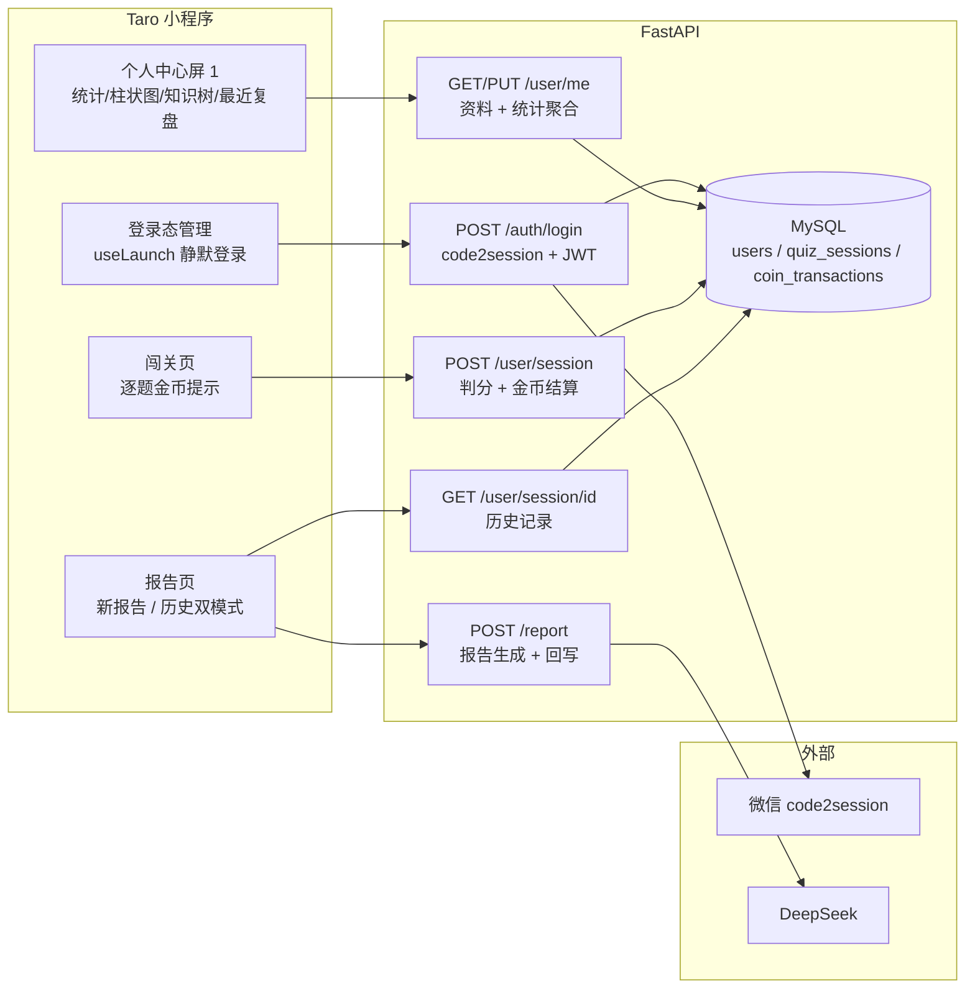
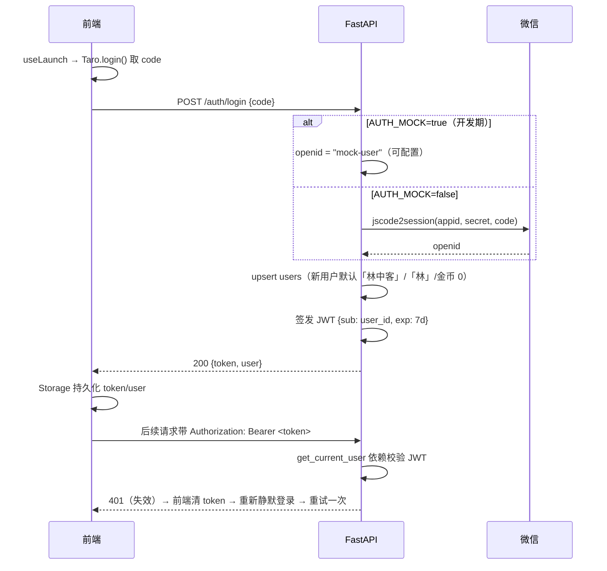
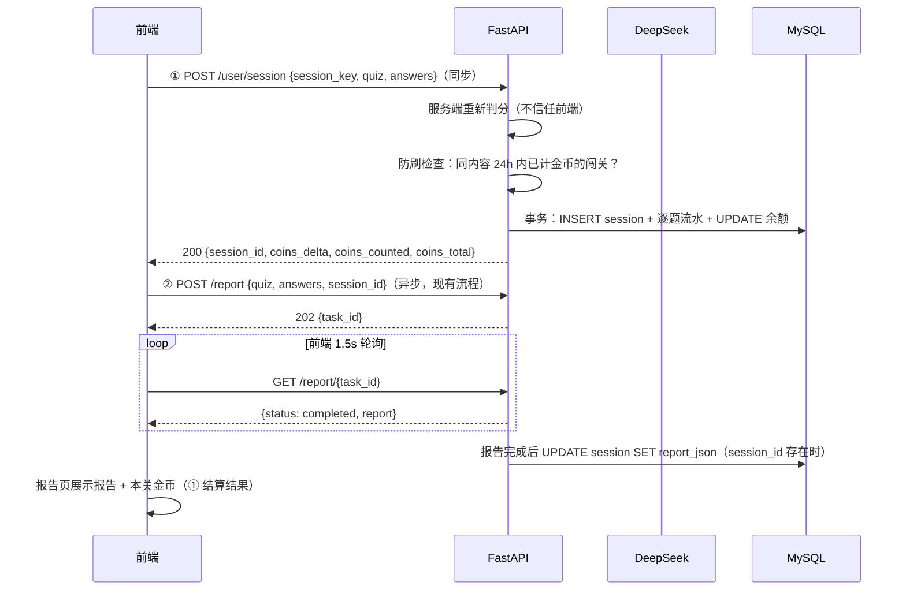

# 《AI 闯关学习小程序》用户系统方案设计文档

| 项目 | 内容 |
| --- | --- |
| 文档版本 | v1.0 |
| 编写日期 | 2026-08-17 |
| 状态 | 待需求方确认 |
| 配套文档 | `需求分析文档-用户系统.md`（本次需求）、`方案设计文档.md`（MVP 总设计） |
| UI 依据 | `prototype/02-extended-flow.html` 屏 1「个人中心 · 学习分析」 |

---

## 1. 设计目标与范围

在 MVP 核心闭环（输入 → 出题 → 答题 → 报告）基础上追加用户系统：**微信静默登录 + JWT 鉴权 + 用户资料 + 答题金币 + 闯关记录/报告持久化 + 个人中心学习分析（原型屏 1）**。需求条目见 `需求分析文档-用户系统.md`，本文档给出技术实现方案。

> 需求文档「待确认问题」4 项按建议值落实：① MOCK 登录共享测试用户（可配置）；② 知识树取最近 10 个知识点、出现 ≥2 次为核心样式；③ 最近复盘 5 条；④ 编辑资料为「✎」图标入口。

## 2. 技术选型（在 MVP 基础上新增）

| 层 | 选型 | 版本 | 说明 |
| --- | --- | --- | --- |
| 数据库 | **MySQL 8**（Docker Compose，容器 `ai-learn-mysql`，独立网络/数据卷，host 端口 3306 起顺延） | 8.x | 方案文档 P1 已定 |
| ORM | **SQLAlchemy 2.x 异步** + aiomysql | SQLAlchemy ≥2.0 | 声明式模型，类型安全，与 FastAPI 异步契合 |
| JWT | **pyjwt** | ≥2.x | HS256 签发/校验 |
| 微信登录 | httpx 调 `jscode2session` | — | 正式模式；开发期 `AUTH_MOCK` 跳过 |
| 测试 | pytest + **aiosqlite**（内存库注入） | — | 单元/接口测试不依赖真实 MySQL |

**新增依赖**（requirements.txt 锁定）：`sqlalchemy`、`aiomysql`、`pyjwt`、`aiosqlite`（测试依赖）。

**建表策略**：应用启动时 `metadata.create_all`（开发期，YAGNI 不引入 Alembic；表结构稳定后如需变更再评估）。

## 3. 系统架构

### 3.1 总体架构（新增部分）



### 3.2 核心时序 · 登录与鉴权



### 3.3 核心时序 · 闯关结算与报告



### 3.4 后端模块划分（新增/修改）

| 模块 | 职责 | 依赖 |
| --- | --- | --- |
| `core/db.py` 新增 | SQLAlchemy async engine / session 工厂（FastAPI 依赖注入，测试可注入 SQLite） | sqlalchemy |
| `models/db_models.py` 新增 | ORM：User / QuizSession / CoinTransaction | core/db |
| `services/auth.py` 新增 | code2session（httpx + MOCK 开关）、JWT 签发/校验（pyjwt） | core/config |
| `services/coins.py` 新增 | 结算服务：判分、防刷、逐题流水 + 余额更新（单事务）、幂等 | models/db |
| `services/stats.py` 新增 | 个人中心聚合：统计卡 / 近七日 / 知识树 / 最近复盘 | models/db |
| `api/deps.py` 修改 | 新增 `get_current_user` 依赖（解析 Bearer JWT → 用户），并注入 db session | services/auth |
| `api/routes/auth.py` 新增 | POST /auth/login | services/auth |
| `api/routes/user.py` 新增 | GET/PUT /user/me、POST /user/session、GET /user/session/{id} | services/coins, stats |
| `api/routes/report.py` 修改 | POST /report 接受可选 `session_id`，完成后回写 `report_json`；任务完成回调内写库 | core/tasks |
| `core/config.py` 修改 | 新增 MySQL/JWT/微信/AUTH_MOCK 配置项 | — |

## 4. 数据库设计

### 4.1 users（用户 + 金币账本）

> 说明：方案文档 6.7 预设计的「金币账本」与 users 为 1:1，并入 users.coins，避免一张无实质收益的独立表；金币流水独立成表。

```sql
CREATE TABLE users (
  id          BIGINT UNSIGNED AUTO_INCREMENT PRIMARY KEY,
  openid      VARCHAR(64)  NOT NULL,
  nickname    VARCHAR(32)  NOT NULL DEFAULT '林中客',
  avatar_text VARCHAR(4)   NOT NULL DEFAULT '林',
  coins       INT          NOT NULL DEFAULT 0,          -- 金币余额（账本，跨设备累计）
  created_at  DATETIME(3)  NOT NULL DEFAULT CURRENT_TIMESTAMP(3),
  updated_at  DATETIME(3)  NOT NULL DEFAULT CURRENT_TIMESTAMP(3) ON UPDATE CURRENT_TIMESTAMP(3),
  UNIQUE KEY uk_openid (openid)
) ENGINE=InnoDB DEFAULT CHARSET=utf8mb4;
```

### 4.2 quiz_sessions（闯关记录，含报告）

```sql
CREATE TABLE quiz_sessions (
  id              BIGINT UNSIGNED AUTO_INCREMENT PRIMARY KEY,
  session_key     CHAR(36)     NOT NULL,                -- 前端生成的 UUID（结算幂等键）
  user_id         BIGINT UNSIGNED NOT NULL,
  content         VARCHAR(2000) NOT NULL,               -- 用户输入原文
  content_hash    CHAR(32)     NOT NULL,                -- MD5（防刷判定）
  topic           VARCHAR(64)  NOT NULL,                -- AI 主题名
  total_questions SMALLINT     NOT NULL,
  correct_count   SMALLINT     NOT NULL,
  correct_rate    SMALLINT     NOT NULL,                -- 0-100，服务端判分
  coins_delta     INT          NOT NULL,                -- 本关金币变动（防刷时为 0）
  coins_counted   TINYINT(1)   NOT NULL DEFAULT 1,      -- 本次是否计入金币
  quiz_json       JSON         NOT NULL,                -- 题目快照（4.2 契约）
  answers_json    JSON         NOT NULL,                -- 作答记录 [{question_id, selected}]
  report_json     JSON         NULL,                    -- AI 报告（4.3 契约），生成后回写
  created_at      DATETIME(3)  NOT NULL DEFAULT CURRENT_TIMESTAMP(3),
  UNIQUE KEY uk_session (user_id, session_key),         -- 幂等唯一约束
  KEY idx_user_created (user_id, created_at),           -- 个人中心列表/统计
  KEY idx_antispam (user_id, content_hash, created_at)  -- 防刷查询
) ENGINE=InnoDB DEFAULT CHARSET=utf8mb4;
```

### 4.3 coin_transactions（金币流水，逐题记录）

```sql
CREATE TABLE coin_transactions (
  id         BIGINT UNSIGNED AUTO_INCREMENT PRIMARY KEY,
  user_id    BIGINT UNSIGNED NOT NULL,
  session_id BIGINT UNSIGNED NOT NULL,
  delta      INT             NOT NULL,                  -- +10 / −5（封底时按实际扣减额）
  reason     VARCHAR(16)     NOT NULL,                  -- quiz_correct / quiz_wrong
  created_at DATETIME(3)     NOT NULL DEFAULT CURRENT_TIMESTAMP(3),
  KEY idx_tx_user_created (user_id, created_at)          -- 与 quiz_sessions 索引区分（SQLite 索引名全库唯一）
) ENGINE=InnoDB DEFAULT CHARSET=utf8mb4;
```

### 4.4 索引与事务说明

- 防刷查询走 `idx_antispam`（用户 + 内容哈希 + 时间范围 + 已计金币过滤）；
- 结算全程单事务（INSERT session → INSERT 逐题流水 → UPDATE 余额 → INSERT 错题），任一失败整体回滚；
- 幂等：`uk_session` 唯一约束冲突时改查已存结果返回，不重复入账（错题收录随首次结算写入，幂等命中不重复收录）。

### 4.5 review_items（错题条目，艾宾浩斯调度）

> 调度状态（next_review_at / correct_streak / missed_count / status）落库——无法从 quiz_sessions 实时推导（间隔递增是历史累计结果）。`question_json` 为题目快照，重练不调 AI。错题从本功能上线后的结算开始收录，不回填历史。

```sql
CREATE TABLE review_items (
  id              BIGINT UNSIGNED AUTO_INCREMENT PRIMARY KEY,
  user_id         BIGINT UNSIGNED NOT NULL,
  session_id      BIGINT UNSIGNED NOT NULL,               -- 来源闯关（幂等由结算幂等保证）
  question_json   JSON           NOT NULL,                -- 题目快照（4.2 单题契约，含 answer/explanation）
  question_type   VARCHAR(8)     NOT NULL,                -- single / multiple / judge
  knowledge_point VARCHAR(32)    NOT NULL,                -- 知识点标签（错题卡展示 + 统计）
  missed_count    SMALLINT       NOT NULL DEFAULT 1,      -- 累计错过次数（「第 N 次错过」）
  correct_streak  SMALLINT       NOT NULL DEFAULT 0,      -- 连续答对次数（0~2；达 3 即掌握）
  next_review_at  DATETIME(3)    NOT NULL,                -- 下次复习时间（调度依据，逾期判定 < 明日 0 点）
  status          VARCHAR(8)     NOT NULL DEFAULT 'pending', -- pending / mastered
  created_at      DATETIME(3)    NOT NULL DEFAULT CURRENT_TIMESTAMP(3),
  mastered_at     DATETIME(3)    NULL,                    -- 掌握时刻（status=mastered 时落）
  KEY idx_user_status_next (user_id, status, next_review_at)  -- 列表/统计/到期扫描
) ENGINE=InnoDB DEFAULT CHARSET=utf8mb4;
```

**SM-2 简化调度规则**（错题收录即错过 1 次）：初始间隔 1 天；每次重练答对，下次间隔按 2/4/7 天递增；连续答对 3 次标记「已掌握」（mastered，移出待重温）；重练答错则重置回 1 天间隔且 `missed_count` +1。间隔序列配置项 `REVIEW_INTERVAL_DAYS`（当前以代码常量 `services/review.REVIEW_INTERVAL_DAYS` 为权威，环境变量为运维预留）。到期判定：`next_review_at` 早于明日 0 点（服务端口径，日期列不加函数包裹以走索引）。

### 4.6 subscribe_quotas（订阅消息配额，一次性订阅）

> 微信一次性订阅：用户授权一次可推送一条。授权时 INSERT 一条（remain=1），推送时任取一条 remain>0 减 1；剩余配额 = SUM(remain)。

```sql
CREATE TABLE subscribe_quotas (
  id          BIGINT UNSIGNED AUTO_INCREMENT PRIMARY KEY,
  user_id     BIGINT UNSIGNED NOT NULL,
  template_id VARCHAR(64)     NOT NULL,                   -- 订阅消息模板 ID
  remain      INT             NOT NULL DEFAULT 1,         -- 剩余配额（授权 +1，推送 −1）
  created_at  DATETIME(3)     NOT NULL DEFAULT CURRENT_TIMESTAMP(3),
  KEY idx_quota_user_created (user_id, created_at)
) ENGINE=InnoDB DEFAULT CHARSET=utf8mb4;
```

**推送链路**：应用内 asyncio 定时任务每日 `REVIEW_PUSH_HOUR`（默认 9 时，首日启动补跑一次）扫描有到期错题的用户 → 剩余配额 ≥1 时消耗 1 条并调微信 `subscribeMessage.send`（access_token 现取现用）；`AUTH_MOCK=true` 或模板 ID 未配置 → 仅记日志不发真实消息（开发期零外部依赖）；发送失败记 WARNING 且不消耗配额（保留重试机会），不影响错题数据与重练流程。

## 5. 接口设计

### 5.1 接口清单

遵循 REST 风格（名词单数、标准状态码），沿用方案文档 4.4 错误码约定并扩展：

| 接口 | 方法 | 鉴权 | 请求 | 响应 |
| --- | --- | --- | --- | --- |
| `/auth/login` | POST | 无 | `{code: string}` | `200 {token, user}`；`422` code 缺失/过长 |
| `/user/me` | GET | ✅ | — | `200 UserProfile` |
| `/user/me` | PUT | ✅ | `{nickname?: string}` | `200 {id, nickname, avatar_text, coins}` |
| `/user/session` | POST | ✅ | `{session_key, quiz, answers}` | `200 {session_id, coins_delta, coins_counted, coins_total}`；`422` 契约非法/敏感 |
| `/user/session/{id}` | GET | ✅ | — | `200 SessionDetail`；`404` 不存在/非本人 |
| `/report` | POST | ✅* | `{quiz, answers, session_id?}` | `202 {task_id}`（session_id 可选，向后兼容） |
| `/report/{task_id}` | GET | 无 | — | 现状不变（轮询） |
| `/user/review` | GET | ✅ | — | `200 ReviewBoard`；`401` 未登录 |
| `/user/review/submit` | POST | ✅ | `{attempts: [{item_id, selected}]}` | `200 {updated}`；`404` item 不存在/非本人；`422` 引用已掌握条目 |
| `/user/subscribe` | POST | ✅ | `{template_id}` | `200 {quota}`；`401` 未登录 |

\* `/report` 要求登录后调用（携带 token），保证 session_id 归属校验；轮询接口维持无鉴权（任务 ID 本身即凭证，MVP 安全模型不变）。

**错误码扩展**：`UNAUTHORIZED`（401 未登录/token 失效）、`INVALID_NICKNAME`（422 昵称非法）、`NOT_FOUND`（404）、`INVALID_STATE`（422 已掌握错题不可重练）。沿用：`SENSITIVE_CONTENT`、`LLM_TIMEOUT`、`LLM_PARSE_FAILED`、`TASK_TIMEOUT`。

### 5.2 数据契约

**POST /auth/login 响应**

```jsonc
{
  "token": "<JWT，有效期 7 天>",
  "user": {"id": 1, "nickname": "林中客", "avatar_text": "林", "coins": 865}
}
```

**GET /user/me 响应（个人中心一次加载，YAGNI 不拆分）**

```jsonc
{
  "user": {"id": 1, "nickname": "林中客", "avatar_text": "林", "coins": 865},
  "stats": {"sessions": 23, "correct_rate": 78, "knowledge_coins": 12},
  // 近 7 天（含今日，今日在最后），按日答题数（= 当日 total_questions 求和），无题为 0
  "daily_answers": [{"date": "2026-08-11", "count": 3}, "...", {"date": "2026-08-17", "count": 4}],
  // 最近 10 个知识点标签，出现 ≥2 次 core=true（深色样式）
  "knowledge_tree": [{"name": "光学", "core": true}, {"name": "干涉", "core": false}],
  // 最近 5 条闯关
  "recent_sessions": [
    {"id": 1, "topic": "光的波粒二象性", "correct_rate": 80, "created_at": "2026-08-17T10:00:00"}
  ]
}
```

**POST /user/session 请求**：`{session_key: 幂等键(8~36 位，hex/连字符), content: 用户输入原文(1~2000 字), quiz: <方案文档 4.2 题库契约>, answers: [{question_id, selected}]}`

**POST /user/session 响应**

```jsonc
{
  "session_id": 1,
  "coins_delta": 25,        // 本关金币变动（防刷时 0；负数可能，如全错 −25）
  "coins_counted": true,    // 本次是否计入金币
  "coins_total": 890        // 最新余额
}
```

**GET /user/session/{id} 响应（历史报告）**

```jsonc
{
  "id": 1, "topic": "光的波粒二象性", "content": "用户输入原文",
  "total_questions": 5, "correct_count": 4, "correct_rate": 80,
  "coins_delta": 25, "coins_counted": true,
  "quiz": {"topic": "...", "questions": [...]},          // 4.2 契约
  "answers": [{"question_id": 1, "selected": [1]}],
  "report": {"correct_rate": 80, "summary": "...", ...}, // 4.3 契约；未生成时为 null
  "created_at": "2026-08-17T10:00:00"
}
```

**PUT /user/me 请求**：`{nickname?: string}`（1~16 字，敏感词过滤；昵称非法 422 `INVALID_NICKNAME`）。响应为 `user` 摘要。头像不传——`avatar_text` 自动同步为昵称首字。

**GET /user/review 响应（错题本）**

```jsonc
{
  // due_count = 待重温数（pending 总数，入口卡徽标/统计口径）；mastered_count = 累计已掌握
  "summary": {"due_count": 3, "mastered_count": 12},
  // 全部 pending（含未到期），按 next_review_at 升序；question 为题目快照（4.2 单题契约，重练直接复用）
  "items": [
    {"id": 1, "question": {"id": 1, "type": "single", "question": "…", "options": ["…"], "answer": [1], "explanation": "…", "knowledge_point": "光学"},
     "question_type": "single", "knowledge_point": "光学",
     "missed_count": 2, "correct_streak": 1,
     "next_review_at": "2026-08-20T09:00:00", "status": "pending"}
  ],
  // 明日起未来 7 天按日到期数（复习安排分组）
  "schedule": [{"date": "2026-08-20", "count": 1}, "…", {"date": "2026-08-26", "count": 0}]
}
```

**POST /user/review/submit 请求**：`{attempts: [{item_id, selected: [0, 1]}]}`——`selected` 为作答选项索引（与闯关 `AnswerRecord` 同心智）。服务端按快照 `answer` 重新判分（不信任前端），单事务应用调度状态机；重练不计金币、不生成报告。

**POST /user/review/submit 响应**

```jsonc
{
  // correct = 服务端重判结果（前端结果页统计以服务端为准）
  "updated": [
    {"item_id": 1, "status": "pending", "correct_streak": 1, "missed_count": 1,
     "next_review_at": "2026-08-21T09:00:00", "mastered": false, "correct": true}
  ]
}
```

错误：`404 NOT_FOUND`（item 不存在或非本人，不泄露存在性）；`422 INVALID_STATE`（attempts 引用已掌握条目）。

**POST /user/subscribe 请求**：`{template_id}`（订阅消息模板 ID）。前端仅在 `wx.requestSubscribeMessage` 授权成功后调用。响应：`200 {quota}`（当前剩余配额 = 历史授权累计 − 已消耗）。

### 5.3 鉴权机制

- 签发：`pyjwt` HS256，payload `{sub: user_id, exp: now + 7d}`，密钥 `JWT_SECRET`（.env）；
- 校验：`get_current_user` 依赖解析 Bearer token → 加载用户；token 缺失/无效/过期 → `401 UNAUTHORIZED`（附带 `TOKEN_EXPIRED` 区分）；
- 越权：`GET /user/session/{id}` 校验 `session.user_id == 当前用户`，否则 404（不泄露存在性）。

## 6. 关键业务规则

### 6.1 判分规则（服务端权威，不信任前端）

- `selected` 与 `answer` 索引数组完全一致才算对（多选必须全中，与小程序端一致）；
- `correct_rate = round(correct_count / total_questions * 100)`；
- `quiz`/`answers` 均通过 Pydantic 契约校验（复用现有 schema），非法返回 422。

### 6.2 金币结算

| 场景 | 入账 |
| --- | --- |
| 答对 1 题 | +10 |
| 答错 1 题 | −5（余额不足时按余额封底，即扣至 0，流水按实际扣减额记录） |
| 防刷命中（同内容 24h 内已计金币） | 0（记录仍保存，`coins_counted=false`） |

- 逐题生成流水（reason: `quiz_correct` / `quiz_wrong`），同事务更新 `users.coins`；
- 单关金币 = 答对数 × 10 − 答错数 × 5，上限 +50 / 下限 −25（受余额封底约束）；
- 防刷判定：查该用户 `content_hash` 相同且 24h 内 `coins_counted=1` 的记录，存在即命中（`idx_antispam` 索引）；
- 幂等：同 `(user_id, session_key)` 重复提交 → 返回首次结算结果，不重复入账。

### 6.3 报告回写

- `POST /report` 新增可选 `session_id`：校验其归属当前用户后，报告任务完成时 `UPDATE quiz_sessions SET report_json`；
- 报告生成失败（现有 failed 机制）→ `report_json` 保持 NULL，历史查看时前端提示「报告生成失败」；
- 报告生成超时/任务清理后前端仍可看题目与判分（quiz/answers 已落库）。

### 6.4 错题重练（旧识重温）

- **收录**：结算事务内，答错题（服务端判分结果）快照写入 `review_items`；防刷命中（`coins_counted=false`）的闯关同样收录（答题事实真实，仅金币不计）；幂等命中不重复收录；错题从本功能上线后的结算开始收录，不回填历史；
- **调度**：SM-2 简化（见 4.5）——答对递增间隔（1→2→4→7 天），连续 3 次答对掌握；答错重置 1 天 + `missed_count`+1；逾期条目持续出现在待重温列表直至重练或掌握；
- **重练**：宝藏关卡加载全部到期错题（`next_review_at` 早于明日 0 点）逐题作答，提交时服务端按快照重判 + 单事务更新调度状态；不计金币、不调 AI、不生成报告；
- **订阅推送**：一次性授权配额落库（授权一次推一条），每日定时扫描到期错题按配额下发；MOCK 降级仅日志（见 4.6）；推送仅作触达增强——错题本页 banner 始终兜底提醒。

## 7. 前端设计

### 7.1 新增/修改文件

```
miniprogram/src/
├── api/auth.ts                新增：POST /auth/login
├── api/user.ts                新增：getMe / updateMe / submitSession / getSession
├── utils/auth.ts              新增：登录态管理（静默登录、token/user 存取、401 重登重试）
├── api/request.ts             修改：自动带 Authorization；401 触发重登重试（登录接口自身除外）
├── app.ts                     修改：useLaunch 静默登录
├── pages/profile/index.tsx    重写：屏 1 完整实现（原型为依据）
├── pages/profile/index.scss   重写：统计卡/柱状图/知识树/最近复盘/编辑弹层样式
├── pages/quiz/index.tsx       修改：每题作答后金币提示（+10/−5）
└── pages/report/index.tsx     修改：双模式（新报告 mode=new / 历史 mode=history）
```

### 7.2 登录态管理（utils/auth）

- `ensureLogin()`：有 token 直接返回；无 token → `Taro.login()` → `POST /auth/login` → 存 Storage；
- `request.ts`：统一注入 `Authorization: Bearer`；收到 401 → 清 token → `ensureLogin()` → 原请求重试一次；仍 401/失败 → 抛出 `UNAUTHORIZED` 文案；
- 登录失败降级：核心闯关流程可继续（未登录可玩），但 `POST /user/session` 返回 401 时闯关页提示「登录后可积累金币」且不阻断报告生成。

### 7.3 闯关页金币提示（逐题，本地即时）

- 每题作答后，在判分词旁展示金币变动（本地判分）：答对「涟漪泛起 · **+10 金币**」苔绿；答错「这条小径值得再走一遍 · **−5 金币**」枫红；
- 样式沿用现有 verdict 设计，不加新组件；
- 最终入账以 `POST /user/session` 结算为准（防刷/封底会修正），报告页展示本关金币汇总。

### 7.4 个人中心屏 1（严格对照原型 02 屏 1）

- 章节名「我的林间日志」、用户信息区（文字头像 + 昵称 + 「已漫步 X 次 · 累计答对 Y 题 · 金币 Z」+ ✎ 编辑入口）；
- 4 张统计卡：闯关数 / 总正确率 / 掌握知识点数 / 金币余额；
- 近七日柱状图：7 根柱（今日晨光金高亮，其余湖水青碧渐变），图例「答题数 / 今日」，SVG 柱状（沿用湖畔风格）；
- 知识树：树枝 SVG + 知识气泡（core 深色、普通描边），数据来自 `knowledge_tree`；
- 最近复盘：最近 5 条（主题 + 相对时间 + 正确率 + ✓ 满分标记），点击 `navigateTo` 报告页 `?mode=history&id={session_id}`；
- 空态：无记录时展示现有空态卡片 + 「去漫步」按钮（沿用占位页设计）；
- 编辑资料：✎ 进入编辑弹层（`input type="nickname"` 微信昵称填写能力）→ `PUT /user/me` → 刷新页面，头像自动变首字。

### 7.5 报告页双模式

- `mode=new`（现状流程）：闯关完成 → ① `submitSession` 结算 → ② `POST /report` 带 `session_id` → 轮询 → 展示报告 + 本关金币（结算结果）；
- `mode=history`：`GET /user/session/{id}` → 渲染报告（report 为 null 时显示「报告生成失败」占位）；「再闯一关」隐藏或改为以该主题重新出题（保持现状）。

## 8. 环境与配置

### 8.1 Docker Compose（项目根目录，遵循全局规范）

```yaml
services:
  mysql:
    image: mysql:8.0
    container_name: ai-learn-mysql
    restart: unless-stopped
    environment:
      MYSQL_ROOT_PASSWORD: ${MYSQL_PASSWORD}
      MYSQL_DATABASE: ${MYSQL_DB}
      MYSQL_USER: ${MYSQL_USER}
      MYSQL_PASSWORD: ${MYSQL_PASSWORD}
    ports:
      - "${MYSQL_PORT:-3306}:3306"
    volumes:
      - ai-learn-mysql-data:/var/lib/mysql
    networks:
      - ai-learn-net

volumes:
  ai-learn-mysql-data:

networks:
  ai-learn-net:
```

- 容器/网络/数据卷统一 `ai-learn-` 前缀；host 端口从 3306 起检测顺延，实际端口记入 `.env`；
- 提供 `start-docker.ps1` / `start-docker.sh` / `docker-down.sh`（关闭前先 mysqldump 导出，模板见 `~/.claude/templates/`）。

### 8.2 .env 新增配置（.env.example 同步占位符）

```
MYSQL_HOST=127.0.0.1
MYSQL_PORT=<顺延后端口>
MYSQL_USER=ai_learn
MYSQL_PASSWORD=<数据库密码>
MYSQL_DB=ai_learn
JWT_SECRET=<密钥>
JWT_EXPIRE_DAYS=7
WECHAT_APPID=<AppID>
WECHAT_SECRET=<AppSecret>
AUTH_MOCK=true            # 开发默认 true，跳过 code2session
AUTH_MOCK_OPENID=mock-user
```

## 9. 开发步骤（对应需求批次 P0–P5）

> 每步「验证」达标再进入下一步；后端每步先写失败测试再实现（TDD）。

**P0 基础设施**
1. docker-compose.yml + start/down 脚本 → 验证: 一键起库、端口顺延生效
2. `core/db.py` + ORM 三表 + deps 注入 → 验证: 建表成功、CRUD 冒烟（pytest + aiosqlite）
3. config 扩展 + .env.example → 验证: 配置读取正确

**P1 用户登录与鉴权**
4. `services/auth.py`：code2session（MOCK 开关）+ JWT 签发/校验 → 验证: 单测通过
5. `POST /auth/login` + `get_current_user` + 受保护接口 401 → 验证: 登录拿 token、无/坏 token 401
6. 前端：utils/auth + request.ts Bearer/401 重试 + app.ts 静默登录 → 验证: 开发者工具登录成功、401 自动重登

**P2 用户信息与个人中心**
7. `services/stats.py` 聚合 + GET/PUT /user/me → 验证: 单测（统计/七日/知识树/列表、昵称编辑）
8. profile 页屏 1 完整 UI + 编辑资料 → 验证: 对照原型逐项核对、昵称编辑生效

**P3 闯关结算与金币**
9. `services/coins.py`：判分/流水/封底/防刷/幂等 → 验证: 单测全绿
10. `POST /user/session` 路由 → 验证: 接口测试（含重复提交幂等）
11. 前端：闯关页金币提示 + 结算对接 → 验证: 闯关流程金币正确、提示即时展示

**P4 记录持久化与历史报告**
12. `POST /report` 支持 session_id 回写 → 验证: 报告回写单测
13. `GET /user/session/{id}` + 报告页历史模式 + 最近复盘真实数据 → 验证: 历史报告完整查看

**P5 整体联调与回归**
14. 全闭环（登录→出题→答题→结算→报告→个人中心）开发者工具 + 真机回归；MVP 旧功能（出题/答题/海报）回归 → 验证: 闭环一致、无回归

## 10. 测试策略

| 层 | 范围 | 工具 | 要求 |
| --- | --- | --- | --- |
| 后端单测 | auth（登录/JWT/401/过期）、coins（判分/封底/防刷/幂等）、sessions（落库/查询/报告回写）、stats（聚合） | pytest + pytest-asyncio + aiosqlite（内存库注入，不依赖真实 MySQL） | TDD，全部新功能覆盖 |
| 后端集成 | 真实 MySQL 冒烟（起库后跑一次登录→结算→查询链路） | 脚本 | P5 验收前必跑 |
| 前端 | 手测清单：登录、401 重试、闯关金币、个人中心、编辑昵称、历史报告、MVP 回归 | 开发者工具 + 真机 | 按 P0–P5 验证项逐项执行 |

## 11. 风险与应对

| 风险 | 影响 | 应对 |
| --- | --- | --- |
| code2session 不稳定/无正式 AppID | 登录失败 | AUTH_MOCK 开关兜底；真实调用失败返回 502 文案「登录失败，请重试」 |
| 前端时间与服务端不一致 | 七日统计边界模糊 | 统计口径以服务端本地日期为准，前端只渲染 |
| 金币作弊（篡改 answers） | 虚增金币 | 服务端重新判分 + 防刷 + 幂等；后续可加行为风控 |
| 服务器时区 | 日期聚合错位 | 统一使用服务进程本地时区（开发环境 UTC+8），不混用 UTC |
| 报告生成失败/超时 | 历史报告缺失 | report_json 为 NULL 可降级展示；题目与判分已落库不影响回顾 |
| MySQL 数据丢失 | 用户数据损失 | 关闭容器前先 mysqldump（docker-down.sh 内置）；数据卷持久化 |
