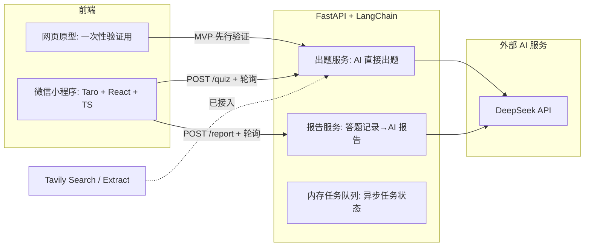
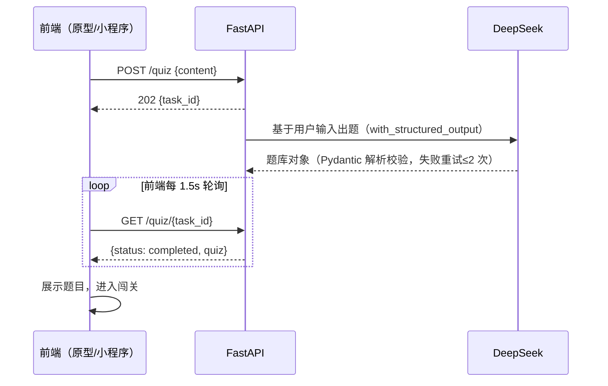
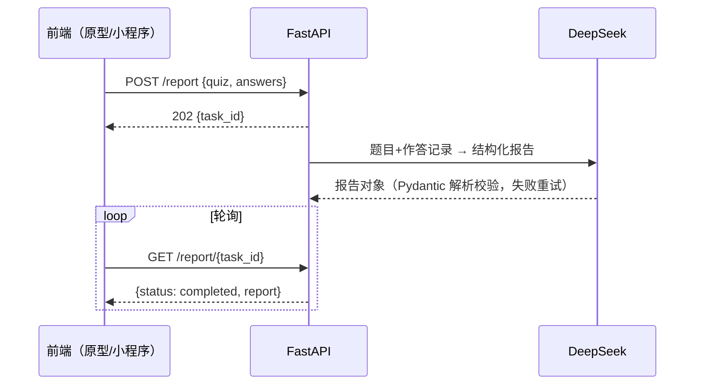

<!-- vscode-markdown-toc -->
* [1. 项目概述](#)
  * [1.1 产品定位](#-1)
  * [1.2 核心业务流程（MVP 唯一目标）](#MVP)
  * [1.3 MVP 范围界定](#MVP-1)
* [2. 技术选型](#-1)
  * [2.1 选型总览](#-1)
  * [2.2 小程序端选型（重点）：原生 vs Taro vs uni-app](#vsTarovsuni-app)
    * [2.2.1 三方现状（来自官方文档/官方发布记录）](#-1)
    * [微信原生（TS + Skyline + glass-easel）](#TSSkylineglass-easel)
    * [Taro（京东开源）](#Taro)
    * [uni-app（DCloud）](#uni-appDCloud)
    * [2.2.2 维度对比](#-1)
    * [2.2.3 选型结论：Taro 4.2.1（React + TS）](#Taro4.2.1ReactTS)
  * [2.3 后端选型：FastAPI + LangChain](#FastAPILangChain)
  * [2.4 AI 大模型选型：DeepSeek](#AIDeepSeek)
  * [2.5 联网搜索选型：Tavily（已落地，含决策记录）](#Tavily)
* [3. 系统架构设计](#-1)
  * [3.1 总体架构](#-1)
  * [3.2 核心时序：出题（异步任务 + 轮询）](#-1)
  * [3.3 核心时序：答题与报告](#-1)
  * [3.4 后端模块划分](#-1)
  * [3.5 前端策略：网页原型先行（已确认）](#-1)
* [4. 接口与数据契约](#-1)
  * [4.1 API 设计](#API)
  * [4.2 题库数据契约（后端出题 → 前端答题的共同语言）](#-1)
  * [4.3 报告数据契约](#-1)
  * [4.4 异常处理原则](#-1)
* [5. AI 工程设计](#AI)
  * [5.1 出题流水线](#-1)
  * [5.2 Prompt 模板（初始版，存放于 `server/app/core/prompts/`）](#Promptserverappcoreprompts)
    * [出题（MVP 版）](#MVP-1)
    * [报告生成](#-1)
  * [5.3 结构化输出可靠性保障（基于 LangChain）](#LangChain)
  * [5.4 内容合规（MVP 轻量方案）](#MVP-1)
* [6. 开发流程与实施步骤](#-1)
  * [步骤 0：环境与账号准备](#0)
  * [步骤 1：后端出题 + 报告服务（跑通 API 层）](#1API)
  * [步骤 2：独立网页原型（跑通核心闭环 ✅）](#2)
  * [步骤 3：Taro 小程序实现（真机跑通闭环）](#3Taro)
  * [步骤 4：分享海报](#4)
  * [后续迭代路线（对应需求文档 P1~P3）](#P1P3)
* [7. 工程结构与开发规范](#-1)
  * [7.1 目录结构（monorepo）](#monorepo)
  * [7.2 开发规范要点](#-1)
* [8. 测试策略](#-1)
* [9. 成本估算](#-1)
* [10. 风险与应对](#-1)
* [11. 附录：参考资料](#-1)

<!-- vscode-markdown-toc-config
	numbering=false
/vscode-markdown-toc-config -->

# 《AI 闯关学习小程序》方案设计文档

| 项目 | 内容 |
| --- | --- |
| 文档版本 | v1.1 |
| 编写日期 | 2026-08-15 |
| 状态 | 待评审 |
| 配套文档 | `需求分析文档.md` |

---

## <a name=''></a>1. 项目概述

### <a name='-1'></a>1.1 产品定位

深度集成微信生态的 AI 学习小程序，将用户输入的非结构化知识（一句话、一段文本，后续扩展到文档/视频/网页）转化为交互式问答闯关游戏，主打"万物皆可闯关"。

### <a name='MVP'></a>1.2 核心业务流程（MVP 唯一目标）

```text
用户输入内容 → AI 直接生成题库 → 用户答题闯关（即时判分+讲解）→ AI 生成复盘报告
```

MVP 的唯一验收标准：**这条闭环先在最简载体（浏览器网页原型）上完整跑通，再迁移到微信小程序真机完整跑通**。

### <a name='MVP-1'></a>1.3 MVP 范围界定

| 类别 | 内容 |
| --- | --- |
| ✅ 做 | 单文本输入、AI 直接出题（5 题：单选/多选/判断）、答题即时判分与讲解、AI 复盘报告、网页原型先行验证、微信小程序实现、分享海报（Canvas） |
| ❌ 不做 | 用户登录注册、数据库持久化、经验值系统、**联网搜索**、多格式输入（PDF/Word/URL/视频）、RAG 私有知识库、好友对战 PK、服务器部署上线 |

不做登录注册与数据库的原因：MVP 阶段验证的是"AI 出题质量 + 游戏化学习体验"这一核心假设，答题与报告均为一次性即时交互，无需持久化；引入账号体系会显著拉长开发周期且不改变核心假设的验证结果。

> 决策记录（v1.1 更新）：
>
> 1. 金币系统经确认改为**答题金币**（答对 +10 / 答错 −5，余额不为负），**P1 随登录 + MySQL 落地**；MVP 答题页仍只做对错判定与讲解；经验值系统不做；
> 2. **联网搜索整体延后至 P1**：MVP 由 AI 直接基于用户输入出题，降低外部依赖、加快闭环速度；代价是知识新鲜度受限（见第 10 章风险）；
> 3. **前端策略调整为"网页原型先行"**：先用独立一次性网页原型（纯 HTML）在浏览器中验证交互，再使用 Taro 实现小程序（见 3.5）；
> 4. AI 大模型对接改用 **LangChain 框架**（见 2.3/2.4）；
> 5. **好友对战 PK 移除**：原 P2「社交对战与排行榜」拆分——PK 不做，排行榜保留并改为**金币排行榜**（按累计答题金币排序，规则见 6.7）。

---

## <a name='-1'></a>2. 技术选型

### <a name='-1'></a>2.1 选型总览

| 层 | 选型 | 版本（2026-08） |
| --- | --- | --- |
| 小程序端 | **Taro + React + TypeScript** | Taro 4.2.1 |
| 网页原型 | 纯 HTML + CSS + 原生 JS（一次性验证用，不进入生产） | — |
| 后端 | **Python + FastAPI + LangChain** | Python 3.11+，LangChain 1.x |
| 大模型 | **DeepSeek**（官方 API，**OpenAI 兼容 API 接入**） | deepseek-v4-flash |
| 联网搜索 | Tavily Web Search API（langchain-tavily 官方包，已接入） | v0.2.18 |
| 数据存储 | 无（MVP 零数据库；**P1 引入 MySQL**，Docker Compose 部署） | MySQL 8.x（P1） |

### <a name='vsTarovsuni-app'></a>2.2 小程序端选型（重点）：原生 vs Taro vs uni-app

选型时间点：2026-08。以下对比基于三方官方文档与发布记录核实。

#### <a name='-1'></a>2.2.1 三方现状（来自官方文档/官方发布记录）

#### <a name='TSSkylineglass-easel'></a>微信原生（TS + Skyline + glass-easel）

* 基础库 v3.17.1（2026-07-01），每月 1~2 次高频迭代；
* Skyline 渲染引擎每个版本均有修复/增强（v3.17.1 修复 skyline placeholder、v3.15.2 新增 selection 支持、v3.14.2 支持 ScrollViewContext velocity…），接入量同比增长 17 倍，鸿蒙微信已灰度支持；启动耗时降 20%、跳页耗时降 50%；
* glass-easel 组件框架为官方推进方向（WebView 模式也在迁移），有专门适配指引；
* TypeScript 官方模板、miniprogram-ci 命令行发布均已成熟。

#### <a name='Taro'></a>Taro（京东开源）

* 最新 v4.2.1（2025-07-17），此后一年未发新版；3.x/4.x 双线维护（3.x 仅修复）；
* 4.x 更新日志中无任何 Skyline 支持内容，近期重心为鸿蒙适配与 vite 支持；
* 社区反馈（2025-2026）普遍认为 4.x 升级路径混乱、生态未跟上，部分项目保持在 3.x；
* UI 生态单薄，成熟可用仅 NutUI（京东官方，React/Vue 双版本）。

#### <a name='uni-appDCloud'></a>uni-app（DCloud）

* 版本线 4.87 → 5.x（2026-07 发布 5.15），重心明显转向 App 端（"蒸汽模式"新渲染系统、uni-app x 编译为原生），微信小程序端以跟随修复为主；
* 生态最大（插件市场、踩坑案例最多）、Vue 语法、条件编译灵活；
* 短板：微信新能力跟进滞后；组件库命名混乱（uView 四个分支）；HBuilderX 强绑定（可用 CLI 绕开）。

#### <a name='-1'></a>2.2.2 维度对比

| 维度 | 微信原生 | Taro 4.x | uni-app |
| --- | --- | --- | --- |
| 最新版本（2026-08） | 基础库 v3.17.1，月更 | v4.2.1，停更 1 年+ | 5.x，重心在 App |
| 微信新 API 跟进 | 官方即时 | 滞后、无 Skyline | 滞后 |
| 性能 | 最佳（Skyline 独立渲染线程） | 编译层损耗（业务场景够用） | 编译层损耗 |
| 跨端能力 | 仅微信 | 微信/支付宝/抖音/百度等 + H5 | 最广（含 App/H5/全部小程序） |
| 语言/语法 | WXML/WXSS/TS | React/Vue/TS | Vue |
| UI 组件生态 | 官方组件 + 社区（TDesign 小程序等） | NutUI 单薄 | 最大（质量参差） |
| 开发工具 | 微信开发者工具 | VSCode 任意 + 开发者工具预览 | HBuilderX 或 CLI+VSCode |

#### <a name='Taro4.2.1ReactTS'></a>2.2.3 选型结论：Taro 4.2.1（React + TS）

**选择理由**（已与需求方确认）：

1. 需求方有 React 技术基础，且保留未来发布 H5 / 其他平台小程序的可能性——跨端是 Taro 的核心价值；
2. 本项目 MVP 页面少（3 页）、以文本交互为主，无长列表/复杂动画等编译层损耗敏感场景，Taro 的性能代价在本项目中不可感知；
3. 本项目对微信能力的使用（分享海报、保存相册、小程序码）均为 Taro 成熟封装范围，风险可控。

**风险对策**（详见第 10 章）：

* **版本策略**：锁定 Taro 4.2.1，不追新版本；依赖全部锁死版本号（package.json 精确版本 + lock 文件）；
* **逃生通道**：Taro 支持与微信原生代码混写（`taro convert` 反向迁移成本也较低），若遇到框架无法覆盖的微信新 API，可局部降级为原生写法，不必整体迁移；
* **不引入 UI 组件库**：MVP 界面元素简单（输入框、题目卡片、选项按钮、报告卡片），使用 Taro 内置组件 + SCSS 手写，消除对 NutUI 的单点依赖。

### <a name='FastAPILangChain'></a>2.3 后端选型：FastAPI + LangChain

| 对比项 | FastAPI | Spring Boot | Node.js |
| --- | --- | --- | --- |
| AI/RAG 生态 | ★★★ 最强（LangChain、向量库、文档解析库一应俱全） | ★☆ 需更多胶水代码 | ★★ 强 |
| MVP 开发速度 | 快（异步任务、Pydantic 校验开箱即用） | 慢 | 快 |
| 与需求方技术栈匹配 | 与 AI 生态契合 | 需求方主力栈 | 与前端同语言 |

选择理由：本项目是 AI 应用，Python 生态在 LLM SDK、JSON 校验（Pydantic）、后续 RAG（向量库/文档解析）上优势最大；已与需求方确认放弃 Java 路线。

**为何使用 LangChain 对接大模型**（v1.1 新增，已与需求方确认）：

1. **模型可替换**：`init_chat_model` 统一初始化入口，DeepSeek 涨价/容量波动时可切换豆包/通义等其他供应商，业务代码零改动；
2. **结构化输出原生支持**：`with_structured_output(PydanticModel)` 把 Pydantic 模型直接作为输出契约传给模型，自动完成 schema 注入、JSON 解析与类型校验，替代手写"JSON Mode + 解析校验"代码；
3. **Prompt 模板管理**：`ChatPromptTemplate` 支持变量占位，配合 5.2 的模板文件管理，Prompt 迭代只改模板不碰代码；
4. **后续能力**：P1 的 RAG（向量检索）、Agent（工具调用）均在 LangChain 生态内直接扩展。

### <a name='AIDeepSeek'></a>2.4 AI 大模型选型：DeepSeek

**模型**：`deepseek-v4-flash`（官方 API 性价比档位；若实测出题质量不足，升级 `deepseek-v4-pro`，两者 API 兼容，切换仅改一行配置）。

**接入方式**（OpenAI 兼容 API，两条路径互为兜底）：

1. **首选**：`langchain-deepseek` 官方集成——`init_chat_model("deepseek-v4-flash", model_provider="deepseek")`，支持工具调用、结构化输出、流式（`deepseek-reasoner` 推理模型不支持结构化输出，不选用）；
2. **兜底**：DeepSeek 提供 OpenAI 兼容接口，`ChatOpenAI(base_url="https://api.deepseek.com", model="deepseek-v4-flash")` 即可接入，两者代码层面可无缝切换。

**选型理由**：

* 成本极低、中文能力强、结构化输出稳定，适合大批量生成题目；
* OpenAI 兼容接口 + LangChain 集成，模型与供应商可独立替换；
* P1 引入的联网搜索通过独立搜索 API 实现，与模型解耦。

**价格**（每百万 tokens，2026-08-16 起执行峰谷计价，UTC 01:00–04:00、06:00–10:00 为峰时，其余谷时半价）：

| 模型 | 时段 | 输入（未命中缓存） | 输出 |
| --- | --- | --- | --- |
| deepseek-v4-flash | 谷时 | $0.22（≈¥1.6） | $0.66（≈¥4.8） |
| deepseek-v4-flash | 峰时 | $0.44（≈¥3.2） | $1.32（≈¥9.5） |
| deepseek-v4-pro | 谷时 | $0.66（≈¥4.8） | $1.98（≈¥14） |

> 注意：DeepSeek 于 2026-08-06 公告整体上调定价。价格以官方定价页为准，本表仅用于成本量级估算。

### <a name='Tavily'></a>2.5 联网搜索选型：Tavily（已落地）

> 决策记录：早期预选型曾定博查 Bocha（国内直连、数据不出海、DeepSeek 官方供应商），**实施前改选 Tavily**。替换原因：① langchain-tavily 是 LangChain 官方一等公民包，`TavilySearch`/`TavilyExtract` 开箱即用，无需自研 HTTP 封装；② **URL 提取能力**（`TavilyExtract` 按网页地址提取正文）直接支撑「纯 URL 输入出题」场景（需求多格式输入）；③ 免费 1000 次/月，成本更低。代价：放弃国内直连优势，接受跨境网络风险（已用 20s 检索预算 + 失败降级兜底）。

**选型理由**：Tavily 提供 `TavilySearch`（关键词搜索，返回 LLM 清洗后的正文 content）与 `TavilyExtract`（网页地址 → 页面正文 raw_content）两个工具；支持动态参数（结果条数 3~8、搜索深度 basic/advanced），满足「最新前沿知识检索」与「URL 输入直达提取」两种场景。

| 对比项 | Tavily（已选） | 博查 Bocha（弃选） | Serper |
| --- | --- | --- | --- |
| 官方集成 | ✅ LangChain 官方包 | 无官方包，需自研封装 | 无官方包 |
| 网页正文提取 | ✅ TavilyExtract（URL 直达提取） | 仅搜索，无提取 | 仅搜索 |
| 国内直连 | ⚠️ 跨境（偶有波动，有降级兜底） | ✅ 稳定 | ✅ |
| 价格 | $0.008/次起（免费 1000 次/月） | ¥0.036/次 | $2/千次 |
| 结果形态 | LLM 清洗后 content / raw_content | 标题+URL+摘要+AI 摘要 | 仅标题+链接+片段 |

**接口**：`langchain-tavily` 包 `TavilySearch`/`TavilyExtract`（参数 `tavily_api_key`；密钥经 `TAVILY_API_KEY` 环境变量注入，不入仓库）。博查接口 `POST https://api.bochaai.com/v1/web-search` 作废。

**接入方式**：三段式出题流水线（检索计划 → 搜索/提取 → 出题），任一环节失败自动降级为直接出题（不阻塞核心流程）。纯网页地址输入由规则检测直达页面提取，跳过检索计划（省一次 LLM 调用）。

---

## <a name='-1'></a>3. 系统架构设计

### <a name='-1'></a>3.1 总体架构



### <a name='-1'></a>3.2 核心时序：出题（异步任务 + 轮询）



**为什么用轮询而不是 SSE/WebSocket**：小程序 `wx.request` 对 SSE 流式支持有限（需 `enableChunked`，Taro 封装不稳定），WebSocket 需额外连接管理；出题耗时 10~30 秒，1.5s 轮询的延迟感知可接受，实现最简最稳。P1 阶段若做逐题流式出题，再评估升级。

### <a name='-1'></a>3.3 核心时序：答题与报告

**答题过程全部在前端本地完成**：题目已包含答案与讲解，用户点选后立即判分并展示讲解卡片（答对答错均展示），无后端参与——这是保证答题体验零延迟的关键设计。

**报告生成**（复用异步任务+轮询模式）：



### <a name='-1'></a>3.4 后端模块划分

| 模块 | 职责 | 依赖 |
| --- | --- | --- |
| `api/routes` | 路由层：参数校验、任务创建与查询 | services |
| `services/quiz` | 出题流水线编排：构建 Prompt → 结构化出题 → 校验重试 | llm |
| `services/report` | 报告生成与校验重试 | llm |
| `services/llm` | LangChain 模型封装（模型初始化、结构化输出、超时、重试、错误归一化） | langchain |
| `core/tasks` | 内存任务队列：`{task_id: {status, payload, error, created_at}}`，超时清理 | — |
| `core/prompts` | 全部 Prompt 模板集中管理（独立文件，便于迭代） | — |
| `core/sensitive` | 敏感词过滤（黑名单词表 + 简单匹配） | — |
| `models/schemas` | Pydantic 模型：请求/响应/题库/报告契约（同时作为 LLM 结构化输出的 schema） | pydantic |

P1 新增：`services/search`（Tavily 客户端，三段式流水线的中间段）。

模块间只通过接口交互，LLM 供应商可独立替换——应对 DeepSeek 涨价/容量波动的关键设计。

### <a name='-1'></a>3.5 前端策略：网页原型先行（已确认）

> 决策记录：**UI 细节不做深度设计**。MVP 前端分两步走——先用独立一次性网页原型在浏览器中验证交互，再实现小程序。原型代码一次性使用，不进入生产。

**第一步：独立一次性网页原型（纯 HTML + CSS + 原生 JS，无框架）**

* 快速实现主页/闯关/报告三个页面，直连后端真实 API；
* 目的：以最快迭代速度（浏览器无编译等待、热更新、DevTools 完善）验证交互逻辑与 UI 风格，形成最终交互方案；
* 产出物：交互验证结论 + UI 参考（截图/静态稿），代码本身不保留。

**第二步：Taro 小程序实现（React + TS）**

* 按原型验证后的交互方案正式实现，页面与数据流：

| 页面 | 职责 | 关键状态 |
| --- | --- | --- |
| `pages/index` 主页 | 单输入框 + 生成按钮；生成中展示 loading 动画并轮询 | 输入文本、task_id |
| `pages/quiz` 闯关页 | 题目展示、选项点选、即时判分与讲解卡片、进度条 | quiz 数据（Storage 传递）、当前题号、作答记录 |
| `pages/report` 报告页 | 正确率、知识总结、知识点掌握度、学习建议、金句；生成海报按钮；微信转发分享（`useShareAppMessage` 转发卡片） | report 数据、作答记录 |

**技术要点**：

* **状态管理**：React Hooks + Taro Storage。quiz 数据与作答记录通过 `Taro.setStorageSync` 在页面间传递，不引入 Redux/Zustand（YAGNI）；
* **网络层**：封装 `request` 工具（基于 `Taro.request`，统一 baseUrl/超时/错误提示）；
* **轮询组件**：自定义 `usePollingTask` Hook（1.5s 间隔、超时 90s 提示失败、卸载时停止）；
* **样式**：SCSS + 750 设计稿，不引入 UI 库；
* **海报**：`canvas` 组件 + `Taro.canvasToTempFilePath` 导出 → `Taro.saveImageToPhotosAlbum` 保存相册。小程序码依赖后端微信接口与已注册小程序，本地调试阶段用占位图，上线阶段接入。

---

## <a name='-1'></a>4. 接口与数据契约

### <a name='API'></a>4.1 API 设计

遵循 REST 风格：URL 名词单数，语义化状态码。

| 接口 | 方法 | 请求 | 响应 |
| --- | --- | --- | --- |
| `/quiz` | POST | `{content: string}` | `202 {task_id}`；`422` 内容为空/超长（≤2000 字） |
| `/quiz/{task_id}` | GET | — | `{status, quiz?, error?}`；`404` 任务不存在 |
| `/report` | POST | `{quiz, answers}` | `202 {task_id}`；`422` 数据不合契约 |
| `/report/{task_id}` | GET | — | `{status, report?, error?}`；`404` 任务不存在 |

`status` 枚举：`pending` / `running` / `completed` / `failed`（`failed` 时 `error` 含用户可读的失败原因与错误码）。

错误码约定：`LLM_TIMEOUT` / `LLM_PARSE_FAILED` / `TASK_TIMEOUT`。前端按错误码给出对应文案与"重试"按钮。

> 说明：网页原型直连 FastAPI 调试地址，浏览器无小程序域名白名单限制；小程序在开发者工具中勾选"不校验合法域名"即可联调。

### <a name='-1'></a>4.2 题库数据契约（后端出题 → 前端答题的共同语言）

```jsonc
{
  "topic": "字符串",                    // 学习主题名（用于报告页标题）
  "source_summary": "字符串",           // AI 基于用户输入整理的知识摘要（用于报告生成，不直接展示）
  "questions": [
    {
      "id": 1,                          // 从 1 递增
      "type": "single",                 // "single" | "multiple" | "judge"
      "question": "题干（judge 时为判断句）",
      "options": ["选项1", "选项2", "选项3", "选项4"],
      // judge 固定为 ["正确", "错误"]；single 4 项；multiple 4 项
      "answer": [0],                    // 正确选项索引数组（judge 为 [0] 或 [1]；multiple 至少 2 个）
      "explanation": "深度讲解：为什么对、易错点在哪（答对答错都展示）",
      "knowledge_point": "考察的知识点标签（≤10 字，用于报告中的掌握度分析）"
    }
  ]
}
```

**约束**：5 题 = 2 单选 + 1 多选 + 2 判断（Prompt 中要求，Pydantic 校验类型分布，不满足则整体重试）。

### <a name='-1'></a>4.3 报告数据契约

```jsonc
{
  "correct_rate": 80,                   // 正确率 0-100
  "correct_count": 4,
  "total_questions": 5,
  "summary": "本次学习的知识总结（200~300 字，基于 source_summary 与题目讲解）",
  "mastery": [                          // 逐知识点掌握度
    {"knowledge_point": "字符串", "level": 90, "comment": "掌握良好，注意 xx"}
  ],
  "suggestions": ["学习建议1", "学习建议2"],   // 2~3 条可执行建议
  "quote": "学习金句（≤30 字，用于海报）"
}
```

### <a name='-1'></a>4.4 异常处理原则

* **LLM 调用失败**（超时/限流/解析失败）：自动重试 ≤2 次（指数退避 2s/4s）；仍失败则任务置 `failed`，前端提示"生成失败，请重试"；
* **任务超时**：120s 未完成置 `failed`（TASK_TIMEOUT）；内存任务 30 分钟自动清理（MVP 服务器重启丢任务可接受）。

---

## <a name='AI'></a>5. AI 工程设计

### <a name='-1'></a>5.1 出题流水线

**MVP（一段式）**：用户输入 → 直接出题。

```text
用户输入 content
  → [LangChain] 构建 Prompt → with_structured_output(QuizSchema) 结构化出题
  → 解析校验（LangChain 自动完成）→ 失败重试 ≤2 次
```

**P1（扩展为三段式）**：接入 Tavily 搜索后：

```text
用户输入 content
  → [规则检测] 整体是网页地址 → 直达 TavilyExtract 提取（跳过检索计划，省一次 LLM 调用）
  → [LLM 步骤1] 生成检索计划（search：关键词 1~3 个 / extract：判定提取某 URL）
  → [Tavily 步骤2] 逐关键词搜索并拼接（总长度截断至 ~4000 字）或按计划提取 URL 正文
  → [LLM 步骤3] 基于「用户输入 + 搜索结果」生成题库
  → 步骤 1/2 失败 → 降级为仅基于用户输入出题（检索增强零故障影响）
```

**检索计划决策规则**（Prompt 约束，实测行为）：

1. 输入整体是网页地址 → `extract`，url 填该地址；
2. 输入包含网页地址且知识以该网页内容为核心 → `extract`（如「学习 `https://x.com` 的用法」「`https://x.com` 是什么」）；
3. 其他情况 → `search`，提取 1~3 个具体关键词（中英文专有名词保留原文）。

**执行防御（实测暴露后补充）**：

* **无效 URL 拦截**：LLM 可能把「https://」误判为可提取地址（实测发生），`extract` 分支调用前用 `is_url()` 校验 `plan.url`，无效即记 `invalid_url` 警告并降级一段式出题——不白耗一次 Tavily 调用；
* **检索预算 20s**：串行搜索/提取整体 `asyncio.timeout(20)`，防顶穿 120s 任务超时；超时/异常一律降级；
* **空结果处理**：搜索无结果 / 提取返回空正文 → 返回 None（一段式出题），不报错。

要点：

* 温度参数：出题 `temperature=0.7`（保证题目多样性）、报告 `0.5`、检索计划 `0.3`（计划要稳定）；
* 系统提示词固定不变（可被 DeepSeek 上下文缓存命中，降低输入成本）。

### <a name='Promptserverappcoreprompts'></a>5.2 Prompt 模板（初始版，存放于 `server/app/core/prompts/`）

#### <a name='MVP-1'></a>出题（MVP 版）

```text
你是一位经验丰富的学习教练。根据「用户想学的知识」，设计一套交互式闯关题目，
帮助用户掌握该知识的核心要点。

【用户想学的知识】
{content}

【出题要求】
1. 共 5 道题：2 道单选题、1 道多选题、2 道判断题；
2. 题目由浅入深，覆盖该知识最核心的 3~5 个知识点；
3. 每道题的 explanation 必须深入讲解：说明正确选项为什么正确、
   易混淆选项错在哪里、关联的易错点；语言通俗易懂，150 字左右；
4. knowledge_point 为该题考察的知识点标签（≤10 字），
   不同题目可以有相同知识点；
5. 判断题的 options 固定为 ["正确", "错误"]；
6. 内容不得包含任何政治敏感、违法或违反公序良俗的表述。

（P1 接入联网搜索后，此处将追加【参考资料】段落：{search_results}）
```

输出结构由 `with_structured_output(QuizSchema)` 的 Pydantic schema 约束，不在 Prompt 中描述 JSON 格式。

#### <a name='-1'></a>报告生成

```text
你是一位学习教练，请根据学生的「闯关记录」生成学习复盘报告。

【闯关记录】
题目与讲解：{quiz}
学生作答：{answers}   // [{question_id, selected}]

【要求】
1. summary：结合题目讲解与 source_summary，总结本次学习的核心知识（200~300 字）；
2. mastery：按 knowledge_point 聚合，评估学生每个知识点的掌握程度（0~100），
   答错的题其知识点得分应显著降低，comment 给出针对该学生的具体点评；
3. suggestions：2~3 条下一步可执行的学习建议；
4. quote：一句与本次学习主题相关的学习金句（≤30 字，有感染力）。
```

输出结构由 `with_structured_output(ReportSchema)` 约束。

### <a name='LangChain'></a>5.3 结构化输出可靠性保障（基于 LangChain）

```python
from langchain.chat_models import init_chat_model

model = init_chat_model("deepseek-v4-flash", model_provider="deepseek", temperature=0.7)
structured_model = model.with_structured_output(QuizSchema, method="function_calling", include_raw=True)
result = structured_model.invoke(prompt_messages)   # include_raw 返回 {"raw": AIMessage, "parsed": QuizSchema}
parsed = result["parsed"]                            # parsed 解析失败时为 None（不抛异常，须显式处理）
```

1. `with_structured_output` 把 Pydantic 模型（题库/报告契约，即 4.2/4.3）直接作为输出 schema 传给模型，LangChain 自动完成 JSON 解析与类型校验（含题目数量、题型分布、选项数量、answer 索引越界检查）；
2. **method=function_calling**：DeepSeek 不支持 `json_schema` 响应格式，function calling 官方支持且自动解析校验；
3. **include_raw=True**：额外返回原始 AIMessage，用于提取 `usage_metadata` 的 token 用量（日志追踪）；代价是解析失败时 **parsed=None 且不抛异常**——实现层须显式转 `OutputParserException` 让统一重试与错误码分类生效；
4. 解析或校验失败 → 原请求重试 ≤2 次（指数退避 2s/4s）；仍失败 → 任务 `failed`（LLM_PARSE_FAILED），绝不把坏数据发给前端；
5. 失败重试日志附带完整异常栈（`exc_info`），便于定位抖动根因（实测 DeepSeek 偶发返回不满足 function calling 契约的响应，重试兜底有效）。

### <a name='MVP-1'></a>5.4 内容合规（MVP 轻量方案）

* **Prompt 约束**：出题/报告提示词均含内容合规要求（见 5.2）；
* **敏感词过滤**：`core/sensitive` 内置基础黑名单词表（配置文件维护，可通过环境变量扩展自定义词表文件路径），对用户输入与生成结果双向过滤，命中即拒绝出题或任务失败并给出通用提示；
* **P1 升级**：接入第三方内容审核 API（如阿里云内容安全），替换/叠加本地词表。

### <a name='-1'></a>5.5 日志与可观测性

> 目标：异步任务黑盒下，开发者无需改代码重跑即可从日志重建每次执行（提交 → 检索 → 出题/报告 → 完成）的完整调用现场，定位「为什么搜不到」「为什么失败」「为什么慢」。

**日志级别**：`LOG_LEVEL` 环境变量（默认 INFO；DEBUG 输出完整调用内容，含用户输入原文，生产慎用）。lifespan 启动时 `logging.basicConfig` 接入 root logger——**uvicorn 默认不配置 root logger（无 handler 时 INFO 级应用日志被静默丢弃，这是「控制台信息少」的根因）**。

| 级别 | 内容 |
| --- | --- |
| INFO | 事件摘要：任务提交/开始/完成、模型调用成功（第 N/3 次、耗时、schema、token 用量 `tokens=in=xx out=yy`）、检索计划决策、降级原因 |
| DEBUG | 模型调用完整 Prompt 与结构化输出、Tavily 搜索/提取入出参（query/count/depth、结果条数、逐条 URL｜标题、总字符数、耗时、原始响应摘要） |
| WARNING | 失败重试（附 `exc_info` 完整异常栈）、检索降级（reason + error）、无效 URL 拦截 |

**链路贯穿（task_id 聚合）**：所有追踪日志共享同一 `task_id` 字段。任务入口 `current_task_id.set(task_id)` 注入 `ContextVar`，LLM/搜索等深层模块经 `task_id_kv()` 自动携带（无需逐层传参；`asyncio.create_task` 自动拷贝上下文）；任务结束 finally reset（防任务池复用协程串上旧值）。单次执行的全部记录可凭 `task_id` 聚合重建完整调用序列。

**截断**：统一 `truncate_for_log(text, limit=2000)`——超长 Prompt/输出/原始响应截断为前缀 + `…[截断]` 标记，不产生超长日志行。

**启动配置摘要（脱敏）**：启动时打印 `settings.redacted_summary()`——精确字段名集合判定密钥（api_key/password/jwt_secret/wechat_secret/tavily_api_key），脱敏为「前 8 字符 + `***`」，长度 ≤8 整体打码（前缀超过密钥长度等于完整泄露）；普通字段原样（含 jwt 子串的 `jwt_expire_days` 等不误伤）。

**并发快照**：`POST /quiz`、`POST /report` 提交处记录 `running=<count_running()>`（当前 running 任务数），多任务并发时一眼看出队列积压。

---

## <a name='-1'></a>6. 开发流程与实施步骤

> 原则：先跑通核心闭环（步骤 1→2），再迁移小程序（步骤 3）、锦上添花（步骤 4）。每个步骤有独立验证标准，达标再进入下一步。不做登录注册、不做数据库、不做联网搜索。

### <a name='0'></a>步骤 0：环境与账号准备

**产出**：开发环境就绪，后端骨架可运行。

* [ ] 注册 DeepSeek 开放平台账号并充值（获取 API Key）
* [ ] 注册微信小程序账号（个人主体即可，获取 AppID）
* [ ] 安装：微信开发者工具、Node.js 20+、Python 3.11+、Taro CLI（`npm i -g @tarojs/cli@4.2.1`）
* [ ] 创建后端骨架：FastAPI 项目结构 + LangChain 依赖 + `.env` 配置（API Key 不入仓库）+ `GET /health`

**验证**：`GET /health` 返回 200。

### <a name='1API'></a>步骤 1：后端出题 + 报告服务（跑通 API 层）

**产出**：`POST /quiz` + `GET /quiz/{task_id}` + `POST /report` + `GET /report/{task_id}` 完整可用。

1. `models/schemas`：QuizSchema / ReportSchema（Pydantic，即 4.2/4.3 契约，含校验规则）；
2. `services/llm`：LangChain 模型封装（init_chat_model + with_structured_output + 超时/重试/错误归一化）；
3. `services/quiz`：出题服务（Prompt 构建 → 结构化出题 → 重试）；
4. `services/report`：报告服务（同上模式）；
5. `core/tasks`：内存任务队列 + 轮询接口；
6. `core/sensitive`：敏感词双向过滤；
7. 单元测试：mock LLM 响应的正常路径、解析失败重试路径、敏感词拦截路径。

**验证**：脚本/curl 提交真实知识主题（如"光的波粒二象性"），轮询获取 5 道合规题目，JSON 完全符合 4.2 契约；提交作答记录获取合规报告，正确率计算与作答一致。

### <a name='2'></a>步骤 2：独立网页原型（跑通核心闭环 ✅）

**产出**：纯 HTML 原型，浏览器中完整跑通「输入 → 出题 → 答题 → 报告」闭环。

1. 原型三页：主页（输入框+loading）、闯关页（题目/选项/判分/讲解卡片/进度）、报告页（正确率/总结/掌握度/建议/金句）；
2. 直连后端真实 API（浏览器无域名限制，fetch + 轮询）；
3. 交互细节在浏览器中快速迭代（判分动画、讲解卡片展开方式、loading 文案等），形成最终交互方案。

**验证**：浏览器完整跑通闭环，交互方案经需求方确认。**至此核心业务流程（用户输入内容 → AI 生成题目 → 用户答题 → AI 生成分析报告）跑通，MVP 主体验证完成。**

### <a name='3Taro'></a>步骤 3：Taro 小程序实现（真机跑通闭环）

**产出**：微信小程序（主页 + 闯关页 + 报告页），真机跑通闭环。

1. 初始化 Taro 项目（React + TS 模板），按原型确认的交互方案实现三个页面；
2. `request` 封装 + `usePollingTask` Hook；quiz 数据与作答记录经 Taro Storage 传递；
3. 多选必须全选正确答案才判对；答错时讲解卡片正常展示；
4. 开发者工具勾选"不校验合法域名"联调，真机预览验证。

**验证**：真机完整跑通「输入 → 出题 → 答题 → 报告」，正确率与作答记录一致；答错题目的知识点掌握度明显低于答对题目。

### <a name='4'></a>步骤 4：分享海报

**产出**：报告页可生成并保存分享海报。

1. Canvas 绘制海报（背景色块 + 主题名 + 金句 + 正确率 + 小程序码占位图）；
2. `canvasToTempFilePath` → `saveImageToPhotosAlbum`（处理相册授权拒绝场景）；
3. 预留小程序码位置：上线阶段由后端调微信 `getUnlimited` 接口动态生成后替换。

**验证**：真机生成海报并成功保存到相册，文字无截断、多主题名（长/短）布局正常。

### <a name='P1P3'></a>后续迭代路线（对应需求文档 P1~P3）

| 阶段 | 内容 | 技术要点 |
| --- | --- | --- |
| P1 | 联网搜索增强出题 | 已接入 Tavily（2.5 决策记录），出题流水线扩展为三段式（检索计划→搜索/提取→出题），失败降级直接出题 |
| P1 | 登录注册、答题金币、答题记录持久化、历史报告 | 微信授权登录 + MySQL + 任务队列迁移 Redis/Celery（金币：答对 +10 / 答错 −5，余额不为负） |
| P1 | 多格式输入（PDF/Word/URL/视频） | 文档解析库 + 网页正文提取 |
| P1 | 后台分析复盘、艾宾浩斯错题重练 | 错题数据统计 + 订阅消息推送 |
| P2 | 金币排行榜 | 按累计答题金币排序（全服榜 + 微信好友榜，规则见 6.7） |
| P2 | 题目配图/语音播报 | 多模态模型接入 |

**P1 MySQL 部署约定**（遵循全局规范）：Docker Compose 管理，容器命名 `ai-learn-mysql`、独立网络与数据卷，host 端口从 3306 起检测空闲顺延；记录于 `.env`；提供 `start-docker.sh`/`docker-down.sh` 脚本；关闭服务前先 `mysqldump` 导出。

### <a name='CoinRank'></a>6.7 P2 金币排行榜规则（预设计）

> 决策记录：好友对战 PK 已移除；排行榜改为**按累计答题金币排序**（全服榜 + 微信好友榜）。金币随 P1 登录 + MySQL 落地，同一账号跨设备累计。

#### 金币规则

| 场景 | 金币变动 |
| --- | --- |
| 答对 1 题 | +10 |
| 答错 1 题 | −5 |
| 余额下限 | 0（不为负） |

单次闯关（5 题）金币 = 答对数 × 10 − 答错数 × 5，最高 +50（全对）、最低 −25（全错，余额下限 0）。答对/答错即时入账，闯关页展示金币变动（P1 随登录落地后实现）。

#### 排行榜

* 按用户**累计金币余额**排序，同分按累计答对数多者靠前；全服榜 + 微信好友榜（好友榜可隐藏）；
* **上榜门槛**：累计完成 ≥3 次闯关（防止 1 次定榜）；
* **防刷**：同一主题 24 小时内重复闯关仅首次计入金币（P1 上线前按数据定稿）。

#### P1 数据模型

```text
金币账本：user_id(唯一), coins, updated_at
金币流水：id, user_id, delta(±), reason(quiz_correct / quiz_wrong), quiz_id, created_at
排行榜 = 金币账本按 coins 排序（好友榜按微信好友关系过滤）
```

---

## <a name='-1'></a>7. 工程结构与开发规范

### <a name='monorepo'></a>7.1 目录结构（monorepo）

```text
ai-learn/
├── prototype/                  # 一次性网页原型（交互验证用，不进入生产）
│   ├── 01-core-flow.html       # 核心业务流程：主页/生成/答题/报告/海报
│   └── 02-extended-flow.html   # 扩展功能：个人中心/错题本/多格式输入/排行榜
├── miniprogram/                # Taro 4 + React + TS 小程序
│   ├── src/
│   │   ├── pages/
│   │   │   ├── index/          # 主页：输入 + 生成
│   │   │   ├── quiz/           # 闯关页
│   │   │   ├── report/         # 报告页（新报告 / history 读库双模式）
│   │   │   └── mine/           # 我的：金币/历史记录/近七日折线图
│   │   ├── api/                # request 封装（token 注入、401 自动重登）
│   │   ├── utils/              # auth.ts 登录态（ensureLogin 静默登录）
│   │   ├── hooks/              # usePollingTask 等
│   │   └── config.ts           # BASE_URL 唯一来源（request 与 auth 共用）
│   └── package.json            # 版本全部锁定
├── server/                     # FastAPI 后端（应用工厂 + deps 惰性装配）
│   ├── app/
│   │   ├── api/
│   │   │   ├── routes/         # auth / user / quiz / report / qrcode / health
│   │   │   └── deps.py         # store/settings/llm/db 装配到 app.state
│   │   ├── services/           # quiz（三段式流水线）/ report / llm / search / coins
│   │   ├── core/               # config / tasks（内存任务库）/ tracing（task_id 链路）
│   │   │                       #   / prompts / sensitive
│   │   └── models/             # schemas.py（Pydantic 接口/LLM 契约）+ db_models.py（ORM）
│   ├── scripts/                # smoke_user.py 冒烟、debug_tavily.py 诊断
│   ├── tests/                  # pytest 单元测试（195+ 用例，SQLite 内存库）
│   ├── requirements.txt        # 版本全部锁定
│   └── .env.example            # 配置模板（.env 不入仓库）
└── docs/                       # 文档（不提交仓库）：方案设计 + 用户系统需求/方案/实施
```

### <a name='-1'></a>7.2 开发规范要点

* **接口契约单一来源**：4.2/4.3 的 JSON Schema 是前后端共同语言；后端 Pydantic 模型与前端 `types/` 类型定义以本文档为准，改动契约必须先改文档；
* **注释规范**：后端 public 函数/类加 docstring 说明 WHY；前端 TS 接口加 JSDoc；
* **提交规范**：`<type>(<scope>): <subject>`，中文 subject；scope 为 prototype/miniprogram/server/docs；
* **测试规范**：新功能必须带测试（后端 pytest 覆盖核心路径）；前端 MVP 阶段以手测为主（原型浏览器手测 + 小程序真机手测），P1 引入 Jest 组件测试；
* **配置管理**：API Key、模型名等通过 `.env` 管理，代码与提交内容不得出现任何密钥。

---

## <a name='-1'></a>8. 测试策略

| 层 | 范围 | 工具 | MVP 要求 |
| --- | --- | --- | --- |
| 后端单元测试 | llm 客户端、quiz/report 流水线（mock LLM）、任务队列、敏感词过滤 | pytest + pytest-asyncio | 核心路径必须覆盖（正常/重试/超时/敏感词） |
| 后端集成测试 | 真实 DeepSeek 的冒烟脚本（验证 Prompt 有效性与出题质量） | 脚本 + 人工检查题目质量 | 出题质量是产品核心，每轮 Prompt 调整必跑 |
| 前端 | 核心链路手测清单（输入→答题→报告→海报） | 浏览器（原型阶段）+ 开发者工具 + 真机（小程序阶段） | 按步骤 2~4 的验证标准逐项执行 |

出题质量是产品生命线：集成测试不仅要验证结构合法，还要人工评估题目难度梯度、讲解深度、知识点覆盖，形成 badcase 清单反哺 Prompt 迭代。

---


## <a name='-1'></a>11. 附录：参考资料

* [微信小程序基础库更新日志](https://developers.weixin.qq.com/miniprogram/dev/framework/release)
* [微信小程序 Skyline 渲染引擎](https://developers.weixin.qq.com/miniprogram/dev/framework/runtime/skyline/introduction.html)
* [Taro Releases](https://github.com/NervJS/taro/releases)
* [uni-app 版本发布页](https://uniapp.dcloud.io/release.html)
* [DeepSeek API 定价](https://api-docs.deepseek.com/quick_start/pricing/)
* [LangChain 官方文档（DeepSeek 集成）](https://docs.langchain.com/)
* [Tavily 官网](https://tavily.com)（联网搜索增强出题，已接入）
* 需求分析文档（项目内）：`../需求分析文档.md`
