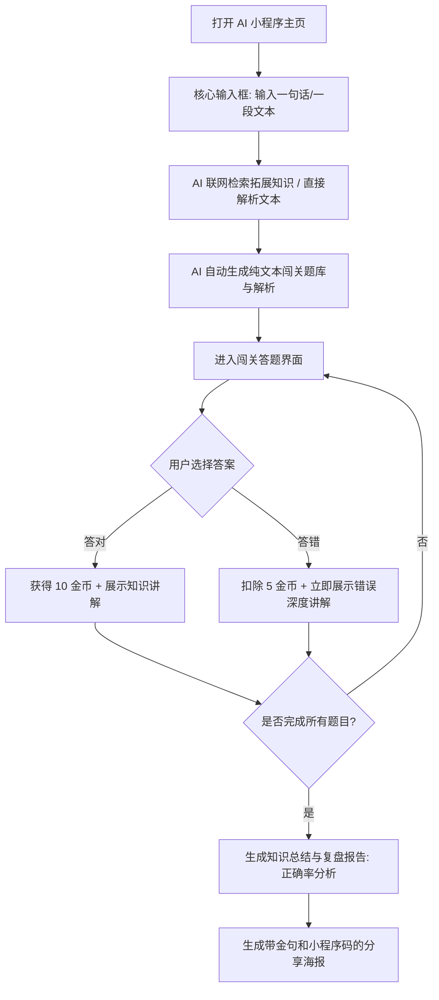

# 《AI 闯关学习小程序》需求分析文档

### 人工需求分析

> 这是我人工确认后的，相对重要的需求，不要忽略

核心功能 MVP（按照用户操作的核心业务流程设计）：

1）用户可以自由输入一个他想学的知识（可以是一句话、一段话、甚至是一个文档 / 一个视频 / 一个网页）

2）AI 自动从全网或者特定的信息源获取知识（比如网络搜索，或者解析文档 / 视频 / 网页）

3）AI 自动生成交互式问答闯关的题目、选项和答案，通过提问引导来增加用户学习的趣味性

4）用户可以自由答题闯关，每道题目选择后立刻给出正确答案和知识讲解（答错也有知识讲解）

5）通关之后会生成一个知识总结和复盘报告，用户可以分享给好友

6）用户可以在后台分析自己所学的知识和答题情况，便于日后复盘，还可以生成报告

---

以下是需求分析文档正文：

### 1. 需求背景

- **核心痛点：** 现代学习者面临“信息过载”与“学习动力不足”的双重痛点。
- **解决方案：** 利用 AI 将非结构化的海量信息（文档、视频、网页）瞬间转化为结构化、趣味性的问答游戏。
- **产品定位：** 深度集成于微信生态的学习小程序，主打“万物皆可闯关”。
- **核心壁垒：** 核心竞争力在于对用户学习流程的“游戏化再造”以及基于微信生态的社交裂变能力。

------

### 2. MVP 最小可行功能点

前期的目标是让用户跑通“输入 -> 答题 -> 总结报告”的极简闭环，确保产品轻量且开发周期极短。

- **单点知识导入：** 主页仅保留一个干净的输入框，用户可以自由输入一个他想学的知识（比如一句话、一段核心概念）。
- **AI 引擎自动出题：** AI 自动基于用户输入的一句话从全网获取知识补充，并自动生成单选题、多选题、判断题。每道题必须配备 AI 生成的深度讲解。
- **核心游戏化机制：** 引入“金币”系统：答对 1 题获得 10 金币、答错扣除 5 金币（余额不为负）；金币跨设备累计，随 P1 登录 + 数据库持久化落地。
- **个人复盘与社交分享：** 通关后利用 AI 生成包含本次学习正确率、知识总结和掌握度百分比的复盘报告，便于日后复盘。支持生成一张包含学习金句及小程序码的精美海报供分享。

------

### 3. 后续扩展功能点 (按优先级排序) 

| **优先级**        | **功能模块**           | **详细说明**                                                 |
| ----------------- | ---------------------- | ------------------------------------------------------------ |
| **P1 (输入扩展)** | **多格式源信息解析**   | 支持上传 PDF/Word 文档、输入网页 URL 或视频链接，AI 自动解析全文并生成题库。 |
| **P1 (深度进阶)** | **RAG 私有知识库**     | 支持用户创建并管理多个私有文件夹，用于企业考核或考试真题模拟。 |
| **P1 (用户留存)** | **后台错题与分析复盘** | 结合艾宾浩斯遗忘曲线监控答错的题目，在特定天数自动触发“旧识重温”宝藏关卡。提供用户后台图表分析分析答题情况。 |

> ✅ **错题/遗忘曲线部分已实现**（2026-08）：错题自动收录 + SM-2 简化调度 + 宝藏关卡重练 + 订阅消息推送（开发期 MOCK 降级）；图表分析部分（知识树）未做
| **P2 (社交留存)** | **金币排行榜**         | 设立按累计答题金币排序的全服与微信好友排行榜（金币：答对 +10 / 答错 −5，余额不为负）。 |
| **P2 (体验增强)** | **多模态生图与交互**   | 前期仅做文本，后期针对题目自动生成示意图片，或支持数字人播报、语音对答 `[todo 确认: 明确前期纯文本，后期多模态]`。 |

------

### 4. 用户操作的具体流程图

代码段

------

### 5. 需求功能核对清单

#### 【P0】核心 MVP 阶段 (跑通一句话出题闭环)

- **基础与 AI 对接：**
  - [x] 申请并配置后端服务器与微信小程序开发者账号。✅ 已配置真实 appid（替换 touristappid，真机预览）
  - [x] 编写核心 Prompt：输入一句话，大模型结合搜索生成包含题干、选项、答案、解析的 JSON 数据。✅ 已实现（联网搜索增强后为三段式出题）
  - [x] 落实敏感词过滤机制，确保生成的题目及解析合规。✅ 已实现（输入/生成双向过滤）
- **前端界面开发：**
  - [x] **极简主页：** 仅包含一个大且醒目的输入框和一个“开始生成”按钮 。✅ 已实现
  - [x] **闯关页：** 题目展示、选项点击逻辑、即时判分与知识讲解。（金币入账 UI 随 P1 落地）✅ 已实现（逐题金币提示 + 结算入账）
  - [x] **反馈交互：** 用户选择选项后立刻弹出正确答案和对应的详细知识讲解。✅ 已实现
  - [x] **报告与分享页：** 展示生成的知识总结、正确率，并利用 Canvas 拼接生成无排名的金句分享海报。✅ 已实现
  - [x] **微信生态：** 实现微信授权登录机制获取用户信息，支持海报一键保存或转发。✅ 已实现（JWT + code2session；开发期 AUTH_MOCK 跳过；H5 降级游客模式）

#### 【P1】功能扩展阶段 (输入源拓宽与留存)

- [x] **多源输入：** 接入文本抓取 API 及基础文档（PDF/Word）解析接口。✅ 部分实现——Tavily 搜索 + 网页 URL 提取已落地（含文本+URL 混合输入）；PDF/Word 解析未做
- [x] **个人中心分析：** 开发用户后台，统计历史答题情况与所学知识树，生成深度复盘报告。✅ 部分实现——历史闯关记录、近七日答题折线图（今日金色高亮）+ 错题重练/遗忘曲线已落地（旧识重温）；知识树未做
- [x] **答题金币：** 答对 +10 / 答错 −5（余额不为负），随登录 + MySQL 落地，闯关页展示金币入账。✅ 已实现（服务端判分、单事务结算、同内容 24h 防刷、幂等提交）
- [x] **RAG 支持：** 构建向量数据库，允许输入私有知识库来生成题目。✅ 已实现（多库管理 + PDF/Word/MD/txt 上传解析 + 向量检索出题；指定库严格模式永不联网，自动模式知识库不足时联网补全）

#### 【P2-P3】高级玩法阶段 (多模态与社交留存)

- [ ] **多模态 AI：** 接入 AI 绘图/语音能力，应用到题目和选项中。❌ 未实现
- [ ] **社交留存：** 开发按累计金币排序的全服/好友排行榜 ❌ 未实现（规则已预设计，见方案设计文档 6.7）
